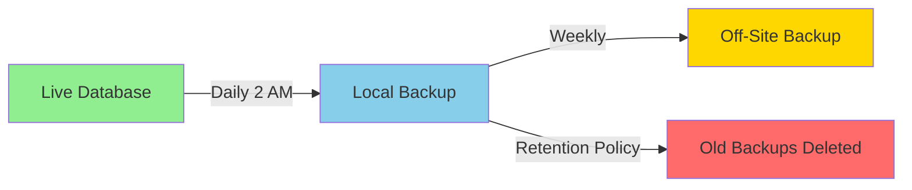

# 💾 Chore-Ganizer Backup and Restore Guide

Complete guide for backing up and restoring Chore-Ganizer data.

---

## 📋 Table of Contents

1. [Overview](#overview)
2. [Backup Script](#backup-script)
3. [Manual Backup](#manual-backup)
4. [Automated Backups](#automated-backups)
5. [Restore Procedures](#restore-procedures)
6. [Backup Verification](#backup-verification)
7. [Off-Site Backups](#off-site-backups)
8. [Disaster Recovery](#disaster-recovery)

---

## 🎯 Overview

### What Gets Backed Up

| Data | Location | Backup Method |
|------|----------|---------------|
| SQLite Database | `data/chores.db` | Compressed backup |
| User Uploads | `data/uploads/` | Optional rsync |
| Configuration | `.env` | Manual (not auto-backed up) |

### Backup Strategy



### Backup Retention Policy

| Backup Type | Retention | Location |
|-------------|-----------|----------|
| Daily | 30 days | `data/backups/` |
| Weekly | 12 weeks | Off-site |
| Monthly | 12 months | Off-site |

---

## 📜 Backup Script

### backup.sh

Create this file in the project root:

```bash
#!/bin/bash

# ============================================
# Chore-Ganizer Backup Script
# ============================================

# Configuration
BACKUP_DIR="./data/backups"
DB_FILE="./data/chores.db"
TIMESTAMP=$(date +"%Y%m%d_%H%M%S")
BACKUP_FILE="${BACKUP_DIR}/chores_${TIMESTAMP}.db.gz"
LOG_FILE="${BACKUP_DIR}/backup.log"
RETENTION_DAYS=30

# Create backup directory if it doesn't exist
mkdir -p "$BACKUP_DIR"

# Log function
log() {
    echo "[$(date '+%Y-%m-%d %H:%M:%S')] $1" | tee -a "$LOG_FILE"
}

# Check if database file exists
if [ ! -f "$DB_FILE" ]; then
    log "ERROR: Database file not found at $DB_FILE"
    exit 1
fi

# Stop backend to ensure consistent backup
log "Stopping backend container..."
docker-compose stop backend

# Create backup
log "Creating backup: $BACKUP_FILE"
if gzip -c "$DB_FILE" > "$BACKUP_FILE"; then
    BACKUP_SIZE=$(du -h "$BACKUP_FILE" | cut -f1)
    log "Backup created successfully: $BACKUP_FILE ($BACKUP_SIZE)"
else
    log "ERROR: Backup creation failed"
    docker-compose start backend
    exit 1
fi

# Start backend
log "Starting backend container..."
docker-compose start backend

# Wait for backend to be healthy
log "Waiting for backend to be healthy..."
sleep 10

# Verify backup integrity
log "Verifying backup integrity..."
if gzip -t "$BACKUP_FILE"; then
    log "Backup integrity verified"
else
    log "ERROR: Backup integrity check failed"
    exit 1
fi

# Clean up old backups
log "Cleaning up backups older than $RETENTION_DAYS days..."
DELETED_COUNT=$(find "$BACKUP_DIR" -name "chores_*.db.gz" -mtime +$RETENTION_DAYS -delete -print | wc -l)
log "Deleted $DELETED_COUNT old backup(s)"

# Summary
TOTAL_BACKUPS=$(find "$BACKUP_DIR" -name "chores_*.db.gz" | wc -l)
TOTAL_SIZE=$(du -sh "$BACKUP_DIR" | cut -f1)

log "Backup completed successfully"
log "Total backups: $TOTAL_BACKUPS"
log "Total size: $TOTAL_SIZE"
log "Latest backup: $BACKUP_FILE"

exit 0
```

### Making the Script Executable

```bash
chmod +x backup.sh
```

### Testing the Backup Script

```bash
# Run the script
./backup.sh

# Check the output
# Should see:
# - Backup created successfully
# - Backup integrity verified
# - Old backups cleaned up

# Verify the backup file exists
ls -lh data/backups/
```

---

## 🖐️ Manual Backup

### Quick Manual Backup

```bash
# Stop backend
docker-compose stop backend

# Create compressed backup
gzip -c data/chores.db > data/backups/chores_manual_$(date +%Y%m%d_%H%M%S).db.gz

# Start backend
docker-compose start backend
```

### Backup with Verification

```bash
# 1. Stop backend
docker-compose stop backend

# 2. Create backup
BACKUP_FILE="data/backups/chores_manual_$(date +%Y%m%d_%H%M%S).db.gz"
gzip -c data/chores.db > "$BACKUP_FILE"

# 3. Verify backup
gzip -t "$BACKUP_FILE" && echo "Backup verified" || echo "Backup corrupted"

# 4. Check backup size
ls -lh "$BACKUP_FILE"

# 5. Start backend
docker-compose start backend
```

### Backup Before Major Changes

Always backup before:

- Updating the application
- Running database migrations
- Making significant configuration changes
- Adding new family members

```bash
# Pre-update backup
./backup.sh

# Or with a custom name
docker-compose stop backend
gzip -c data/chores.db > "data/backups/chores_pre_update_$(date +%Y%m%d_%H%M%S).db.gz"
docker-compose start backend
```

---

## ⏰ Automated Backups

### Setting Up Cron Jobs

#### Daily Backup at 2 AM

```bash
# Edit crontab
crontab -e

# Add this line
0 2 * * * /full/path/to/chore-ganizer/backup.sh >> /full/path/to/chore-ganizer/data/backups/backup.log 2>&1
```

#### Multiple Daily Backups

```bash
# Backup at 2 AM, 8 AM, 2 PM, 8 PM
0 2,8,14,20 * * * /full/path/to/chore-ganizer/backup.sh >> /full/path/to/chore-ganizer/data/backups/backup.log 2>&1
```

#### Hourly Backups (for critical data)

```bash
# Backup every hour
0 * * * * /full/path/to/chore-ganizer/backup.sh >> /full/path/to/chore-ganizer/data/backups/backup.log 2>&1
```

### Verifying Cron Jobs

```bash
# List cron jobs
crontab -l

# Check cron logs
grep CRON /var/log/syslog

# Check backup log
tail -f data/backups/backup.log
```

### Systemd Timer Alternative (Linux)

Create `/etc/systemd/system/chore-ganizer-backup.service`:

```ini
[Unit]
Description=Chore-Ganizer Backup Service
After=docker.service

[Service]
Type=oneshot
User=your-user
WorkingDirectory=/path/to/chore-ganizer
ExecStart=/path/to/chore-ganizer/backup.sh
```

Create `/etc/systemd/system/chore-ganizer-backup.timer`:

```ini
[Unit]
Description=Run Chore-Ganizer backup daily

[Timer]
OnCalendar=*-*-* 02:00:00
Persistent=true

[Install]
WantedBy=timers.target
```

Enable and start:

```bash
sudo systemctl enable chore-ganizer-backup.timer
sudo systemctl start chore-ganizer-backup.timer
sudo systemctl status chore-ganizer-backup.timer
```

---

## 🔄 Restore Procedures

### Restore from Backup

**⚠️ Warning: This will replace your current database!**

#### Step 1: Stop the Backend

```bash
docker-compose stop backend
```

#### Step 2: Backup Current Database (Safety)

```bash
cp data/chores.db data/chores.db.pre-restore-$(date +%Y%m%d_%H%M%S)
```

#### Step 3: Choose Backup to Restore

```bash
# List available backups
ls -lht data/backups/

# Note the backup filename you want to restore
```

#### Step 4: Restore the Backup

```bash
# Restore from compressed backup
gunzip -c data/backups/chores_YYYYMMDD_HHMMSS.db.gz > data/chores.db

# Or if you have an uncompressed backup
cp data/backups/chores_YYYYMMDD_HHMMSS.db data/chores.db
```

#### Step 5: Start the Backend

```bash
docker-compose start backend
```

#### Step 6: Verify the Restore

```bash
# Check backend logs
docker-compose logs backend --tail=50

# Check health
curl http://localhost:3000/health

# Open Prisma Studio to verify data
docker-compose exec backend npx prisma studio
```

### Restore to a Different Database (Testing)

```bash
# Stop backend
docker-compose stop backend

# Restore to a test database
gunzip -c data/backups/chores_YYYYMMDD_HHMMSS.db.gz > data/chores_test.db

# Update DATABASE_URL in .env temporarily
# DATABASE_URL="file:/app/data/chores_test.db"

# Start backend
docker-compose start backend

# Test the restored data

# When done, switch back to original database
```

### Partial Restore (Specific Tables)

SQLite doesn't support partial restores easily. For partial restores:

```bash
# 1. Restore backup to a test database
gunzip -c data/backups/chores_YYYYMMDD_HHMMSS.db.gz > data/chores_restore.db

# 2. Open both databases in Prisma Studio
docker-compose exec backend npx prisma studio

# 3. Manually copy the data you need

# 4. Delete test database
rm data/chores_restore.db
```

---

## ✅ Backup Verification

### Verify Backup Integrity

```bash
# Test gzip integrity
gzip -t data/backups/chores_YYYYMMDD_HHMMSS.db.gz

# Extract and verify
gunzip -c data/backups/chores_YYYYMMDD_HHMMSS.db.gz > /tmp/test_restore.db
sqlite3 /tmp/test_restore.db ".tables"
rm /tmp/test_restore.db
```

### Verify Backup Contents

```bash
# Extract backup
gunzip -c data/backups/chores_YYYYMMDD_HHMMSS.db.gz > /tmp/verify.db

# Check tables
sqlite3 /tmp/verify.db ".tables"

# Check row counts
sqlite3 /tmp/verify.db "SELECT 'User:', COUNT(*) FROM User; SELECT 'Chore:', COUNT(*) FROM Chore; SELECT 'Notification:', COUNT(*) FROM Notification;"

# Clean up
rm /tmp/verify.db
```

### Automated Backup Verification

Add to crontab to verify backups weekly:

```bash
# Every Sunday at 3 AM, verify the latest backup
0 3 * * 0 /path/to/chore-ganizer/verify-backup.sh >> /path/to/chore-ganizer/data/backups/verify.log 2>&1
```

Create `verify-backup.sh`:

```bash
#!/bin/bash

BACKUP_DIR="./data/backups"
LATEST_BACKUP=$(ls -t "$BACKUP_DIR"/chores_*.db.gz | head -1)

echo "Verifying: $LATEST_BACKUP"

if gzip -t "$LATEST_BACKUP"; then
    echo "✓ Backup integrity verified"
    
    # Extract and check
    gunzip -c "$LATEST_BACKUP" > /tmp/verify.db
    TABLES=$(sqlite3 /tmp/verify.db ".tables")
    echo "✓ Tables found: $TABLES"
    rm /tmp/verify.db
    
    echo "✓ Backup verification passed"
else
    echo "✗ Backup verification failed"
    exit 1
fi
```

---

## 🌐 Off-Site Backups

### Option 1: rsync to Remote Server

```bash
# Install rsync if not installed
sudo apt-get install rsync  # Debian/Ubuntu
sudo yum install rsync      # CentOS/RHEL

# Test rsync
rsync -avz --dry-run data/backups/ user@remote-server:/backups/chore-ganizer/

# Add to crontab for daily sync
0 3 * * * rsync -avz --delete /path/to/chore-ganizer/data/backups/ user@remote-server:/backups/chore-ganizer/ >> /path/to/chore-ganizer/data/backups/rsync.log 2>&1
```

### Option 2: rclone to Cloud Storage

```bash
# Install rclone
curl https://rclone.org/install.sh | sudo bash

# Configure cloud storage
rclone config

# Test upload
rclone copy data/backups/ remote:chore-ganizer-backups/ --dry-run

# Add to crontab
0 3 * * * rclone sync /path/to/chore-ganizer/data/backups/ remote:chore-ganizer-backups/ >> /path/to/chore-ganizer/data/backups/rclone.log 2>&1
```

### Option 3: AWS S3

```bash
# Install AWS CLI
pip install awscli

# Configure AWS
aws configure

# Upload backup
aws s3 cp data/backups/chores_YYYYMMDD_HHMMSS.db.gz s3://your-bucket/chore-ganizer/

# Sync all backups
aws s3 sync data/backups/ s3://your-bucket/chore-ganizer/

# Add to crontab
0 3 * * * aws s3 sync /path/to/chore-ganizer/data/backups/ s3://your-bucket/chore-ganizer/ >> /path/to/chore-ganizer/data/backups/s3.log 2>&1
```

### Option 4: Backblaze B2

```bash
# Install B2 CLI
pip install b2

# Authorize
b2 authorize-account

# Create bucket
b2 create-bucket chore-ganizer-backups allPrivate

# Upload backup
b2 upload-file chore-ganizer-backups data/backups/chores_YYYYMMDD_HHMMSS.db.gz backups/chores_YYYYMMDD_HHMMSS.db.gz

# Add to crontab
0 3 * * * b2 sync --delete /path/to/chore-ganizer/data/backups/ b2://chore-ganizer-backups/backups/ >> /path/to/chore-ganizer/data/backups/b2.log 2>&1
```

---

## 🆘 Disaster Recovery

### Complete System Recovery

If the entire system is lost:

#### Step 1: Set Up New Server

```bash
# Install Docker and Docker Compose
curl -fsSL https://get.docker.com -o get-docker.sh
sudo sh get-docker.sh
sudo usermod -aG docker $USER

# Install Docker Compose
sudo curl -L "https://github.com/docker/compose/releases/latest/download/docker-compose-$(uname -s)-$(uname -m)" -o /usr/local/bin/docker-compose
sudo chmod +x /usr/local/bin/docker-compose
```

#### Step 2: Clone Repository

```bash
git clone https://github.com/thitar/chore-ganizer.git chore-ganizer
cd chore-ganizer
```

#### Step 3: Restore Configuration

```bash
# Copy .env from backup
cp /path/to/backup/.env .

# Create data directories
mkdir -p data/backups data/uploads
chmod 755 data data/backups data/uploads
```

#### Step 4: Restore Database

```bash
# Copy backup to server
scp user@backup-server:/backups/chore-ganizer/chores_YYYYMMDD_HHMMSS.db.gz data/backups/

# Restore database
gunzip -c data/backups/chores_YYYYMMDD_HHMMSS.db.gz > data/chores.db
```

#### Step 5: Start Application

```bash
docker-compose up -d --build
```

#### Step 6: Verify

```bash
# Check containers
docker-compose ps

# Check health
curl http://localhost:3000/health

# Check logs
docker-compose logs --tail=100
```

### Recovery Time Objectives

| Scenario | RTO (Recovery Time) | RPO (Data Loss) |
|----------|---------------------|-----------------|
| Database corruption | 15 minutes | 1 backup cycle |
| Server failure | 1-2 hours | 1 backup cycle |
| Complete disaster | 4-8 hours | 1 backup cycle |

### Recovery Testing

Test your recovery procedure regularly:

```bash
# Monthly recovery test
# 1. Stop production
docker-compose down

# 2. Restore from latest backup
gunzip -c data/backups/chores_latest.db.gz > data/chores.db

# 3. Start application
docker-compose up -d

# 4. Verify all functionality
# - Login as parent
# - Create chore
# - Login as child
# - Complete chore
# - Verify points

# 5. Document any issues
```

---

## 📊 Backup Monitoring

### Monitor Backup Status

```bash
# Check latest backup
ls -lht data/backups/ | head -5

# Check backup log
tail -50 data/backups/backup.log

# Check backup size
du -sh data/backups/

# Count backups
ls data/backups/ | wc -l
```

### Backup Alerts

Create a simple alert script:

```bash
#!/bin/bash
# check-backup.sh

BACKUP_DIR="./data/backups"
MAX_AGE_HOURS=26  # Alert if backup is older than 26 hours

LATEST_BACKUP=$(ls -t "$BACKUP_DIR"/chores_*.db.gz 2>/dev/null | head -1)

if [ -z "$LATEST_BACKUP" ]; then
    echo "ERROR: No backups found!"
    exit 1
fi

BACKUP_AGE=$(( ($(date +%s) - $(stat -c %Y "$LATEST_BACKUP")) / 3600 ))

if [ $BACKUP_AGE -gt $MAX_AGE_HOURS ]; then
    echo "WARNING: Latest backup is $BACKUP_AGE hours old!"
    exit 1
fi

echo "OK: Latest backup is $BACKUP_AGE hours old"
exit 0
```

Add to crontab for daily checks:

```bash
0 6 * * * /path/to/chore-ganizer/check-backup.sh | mail -s "Chore-Ganizer Backup Check" your-email@example.com
```

---

## 📝 Backup Checklist

### Daily
- [ ] Verify backup script ran successfully
- [ ] Check backup log for errors
- [ ] Verify latest backup exists

### Weekly
- [ ] Check backup size trends
- [ ] Verify backup integrity
- [ ] Review backup retention

### Monthly
- [ ] Test restore procedure
- [ ] Verify off-site backups
- [ ] Review backup strategy
- [ ] Update documentation if needed

---

**Last Updated:** February 2026  
**Version:** 2.0.0
