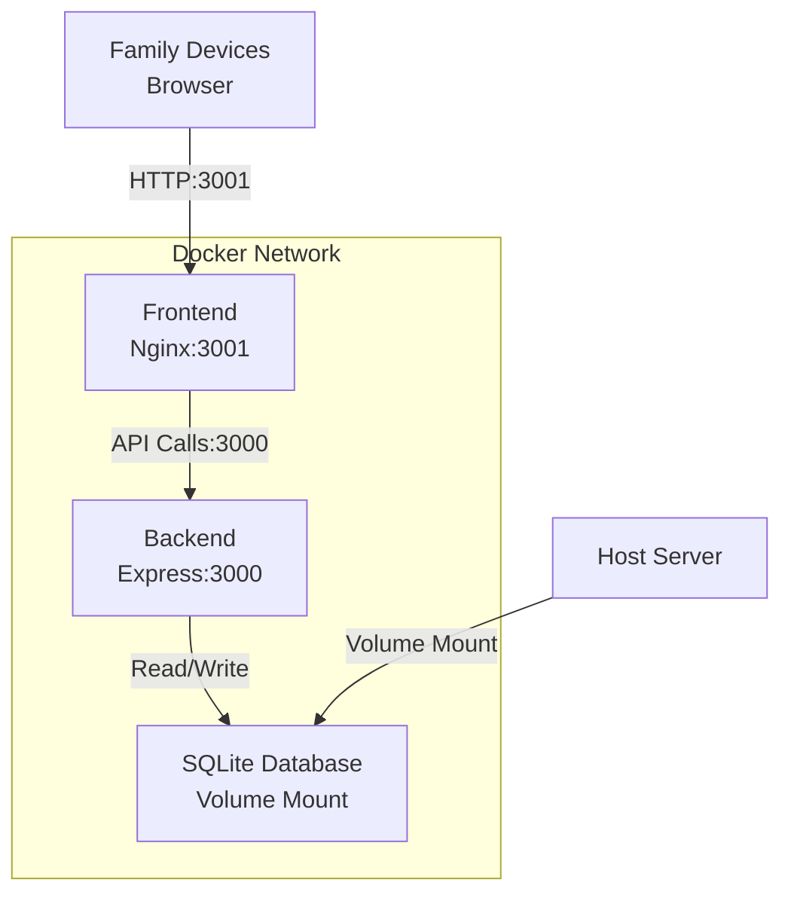

# 🐳 Chore-Ganizer Docker Configuration

Complete Docker setup and configuration reference for Chore-Ganizer.

---

## 📋 Table of Contents

1. [Overview](#overview)
2. [Port Configuration](#port-configuration)
3. [Docker Compose File](#docker-compose-file)
4. [Backend Dockerfile](#backend-dockerfile)
5. [Frontend Dockerfile](#frontend-dockerfile)
6. [Nginx Configuration](#nginx-configuration)
7. [Environment Variables](#environment-variables)
8. [Volumes and Data Persistence](#volumes-and-data-persistence)
9. [Network Configuration](#network-configuration)
10. [Development vs Production](#development-vs-production)

---

## 🎯 Overview

Chore-Ganizer uses Docker Compose to orchestrate two main services:

| Service | Description | Port |
|---------|-------------|------|
| `backend` | Express API with Node.js | 3000 |
| `frontend` | React app served by Nginx | 3001 |

### Architecture Diagram



---

## 🔌 Port Configuration

### Development Ports

| Service | Port | Purpose |
|---------|------|---------|
| Frontend (Vite dev server) | 5173 | Hot-reload development |
| Backend (Express dev server) | 3000 | API development |
| Prisma Studio | 5555 | Database GUI |

### Production Ports

| Service | Port | Purpose |
|---------|------|---------|
| Frontend (Nginx) | 3001 | Production web server |
| Backend (Express) | 3000 | Production API |
| Internal (not exposed) | - | Database access |

### Port Reference Table

| Environment | Frontend | Backend | Prisma Studio |
|-------------|----------|---------|---------------|
| Development | 5173 | 3000 | 5555 |
| Production | 3001 | 3000 | 5555 (via exec) |

---

## 📄 Docker Compose File

### docker-compose.yml

```yaml
version: '3.8'

services:
  backend:
    build:
      context: ./backend
      dockerfile: Dockerfile
    container_name: chore-backend
    restart: unless-stopped
    ports:
      - "3000:3000"
    environment:
      - NODE_ENV=production
      - DATABASE_URL=file:/app/data/chores.db
      - SESSION_SECRET=${SESSION_SECRET}
      - PORT=3000
      - CORS_ORIGIN=${CORS_ORIGIN:-http://localhost:3001}
      - LOG_LEVEL=${LOG_LEVEL:-info}
    volumes:
      - ./data:/app/data
      - ./data/backups:/app/data/backups
      - ./data/uploads:/app/data/uploads
    networks:
      - chore-network
    healthcheck:
      test: ["CMD", "curl", "-f", "http://localhost:3000/health"]
      interval: 30s
      timeout: 10s
      retries: 3
      start_period: 40s

  frontend:
    build:
      context: ./frontend
      dockerfile: Dockerfile
    container_name: chore-frontend
    restart: unless-stopped
    ports:
      - "3001:80"
    environment:
      - VITE_API_URL=${VITE_API_URL:-http://localhost:3000}
    depends_on:
      backend:
        condition: service_healthy
    networks:
      - chore-network

networks:
  chore-network:
    driver: bridge

volumes:
  chore-data:
    driver: local
```

### docker-compose.dev.yml (Optional)

For development with hot-reload:

```yaml
version: '3.8'

services:
  backend:
    build:
      context: ./backend
      dockerfile: Dockerfile.dev
    container_name: chore-backend-dev
    restart: "no"
    ports:
      - "3000:3000"
    environment:
      - NODE_ENV=development
      - DATABASE_URL=file:/app/dev.db
      - SESSION_SECRET=dev-secret-not-secure
      - PORT=3000
      - CORS_ORIGIN=http://localhost:5173
      - LOG_LEVEL=debug
    volumes:
      - ./backend:/app
      - /app/node_modules
      - ./backend/dev.db:/app/dev.db
    command: npm run dev

  frontend:
    build:
      context: ./frontend
      dockerfile: Dockerfile.dev
    container_name: chore-frontend-dev
    restart: "no"
    ports:
      - "5173:5173"
    environment:
      - VITE_API_URL=http://localhost:3000
    volumes:
      - ./frontend:/app
      - /app/node_modules
    command: npm run dev
```

---

## 🔧 Backend Dockerfile

### backend/Dockerfile (Production)

```dockerfile
# Build stage
FROM node:20-alpine AS builder

WORKDIR /app

# Copy package files
COPY package*.json ./
COPY tsconfig.json ./

# Install dependencies
RUN npm ci --only=production

# Copy source code
COPY prisma ./prisma
COPY src ./src

# Generate Prisma client
RUN npx prisma generate

# Build TypeScript
RUN npm run build

# Production stage
FROM node:20-alpine

WORKDIR /app

# Install dumb-init for proper signal handling
RUN apk add --no-cache dumb-init curl

# Create non-root user
RUN addgroup -g 1001 -S nodejs && \
    adduser -S nodejs -u 1001

# Copy from builder
COPY --from=builder --chown=nodejs:nodejs /app/node_modules ./node_modules
COPY --from=builder --chown=nodejs:nodejs /app/dist ./dist
COPY --from=builder --chown=nodejs:nodejs /app/prisma ./prisma
COPY --from=builder --chown=nodejs:nodejs /app/package*.json ./

# Create data directory
RUN mkdir -p /app/data /app/data/backups /app/data/uploads && \
    chown -R nodejs:nodejs /app/data

# Switch to non-root user
USER nodejs

# Expose port
EXPOSE 3000

# Health check
HEALTHCHECK --interval=30s --timeout=10s --start-period=40s --retries=3 \
    CMD curl -f http://localhost:3000/health || exit 1

# Start application
ENTRYPOINT ["dumb-init", "--"]
CMD ["node", "dist/server.js"]
```

### backend/Dockerfile.dev (Development)

```dockerfile
FROM node:20-alpine

WORKDIR /app

# Install dependencies
COPY package*.json ./
RUN npm install

# Copy source
COPY . .

# Generate Prisma client
RUN npx prisma generate

# Expose port
EXPOSE 3000

# Start in development mode
CMD ["npm", "run", "dev"]
```

### backend/.dockerignore

```
node_modules
dist
*.log
.env
.env.local
.env.*.local
.git
.gitignore
README.md
*.md
.vscode
.idea
*.swp
*.swo
.DS_Store
Thumbs.db
dev.db
dev.db-*
```

---

## 🎨 Frontend Dockerfile

### frontend/Dockerfile (Production)

```dockerfile
# Build stage
FROM node:20-alpine AS builder

WORKDIR /app

# Copy package files
COPY package*.json ./

# Install dependencies
RUN npm ci

# Copy source
COPY . .

# Build application
RUN npm run build

# Production stage with Nginx
FROM nginx:alpine

# Copy custom nginx config
COPY nginx.conf /etc/nginx/conf.d/default.conf

# Copy built files from builder
COPY --from=builder /app/dist /usr/share/nginx/html

# Create non-root user
RUN addgroup -g 1001 -S nginx && \
    adduser -S nginx -u 1001 && \
    chown -R nginx:nginx /usr/share/nginx/html && \
    chown -R nginx:nginx /var/cache/nginx && \
    chown -R nginx:nginx /var/log/nginx && \
    chown -R nginx:nginx /etc/nginx/conf.d && \
    touch /var/run/nginx.pid && \
    chown -R nginx:nginx /var/run/nginx.pid

# Switch to non-root user
USER nginx

# Expose port
EXPOSE 80

# Health check
HEALTHCHECK --interval=30s --timeout=10s --start-period=10s --retries=3 \
    CMD wget --no-verbose --tries=1 --spider http://localhost/ || exit 1

# Start nginx
CMD ["nginx", "-g", "daemon off;"]
```

### frontend/Dockerfile.dev (Development)

```dockerfile
FROM node:20-alpine

WORKDIR /app

# Install dependencies
COPY package*.json ./
RUN npm install

# Copy source
COPY . .

# Expose port
EXPOSE 5173

# Start in development mode
CMD ["npm", "run", "dev", "--", "--host", "0.0.0.0"]
```

### frontend/.dockerignore

```
node_modules
dist
build
.env
.env.local
.env.*.local
.git
.gitignore
README.md
*.md
.vscode
.idea
*.swp
*.swo
.DS_Store
Thumbs.db
nginx.conf
```

---

## 🌐 Nginx Configuration

### frontend/nginx.conf

```nginx
server {
    listen 80;
    server_name _;
    root /usr/share/nginx/html;
    index index.html;

    # Gzip compression
    gzip on;
    gzip_vary on;
    gzip_min_length 1024;
    gzip_types text/plain text/css text/xml text/javascript application/x-javascript application/xml+rss application/json;

    # Security headers
    add_header X-Frame-Options "SAMEORIGIN" always;
    add_header X-Content-Type-Options "nosniff" always;
    add_header X-XSS-Protection "1; mode=block" always;

    # API proxy (optional - for same-origin requests)
    location /api/ {
        proxy_pass http://backend:3000/api/;
        proxy_http_version 1.1;
        proxy_set_header Upgrade $http_upgrade;
        proxy_set_header Connection 'upgrade';
        proxy_set_header Host $host;
        proxy_set_header X-Real-IP $remote_addr;
        proxy_set_header X-Forwarded-For $proxy_add_x_forwarded_for;
        proxy_set_header X-Forwarded-Proto $scheme;
        proxy_cache_bypass $http_upgrade;
    }

    # Health check endpoint
    location /health {
        access_log off;
        return 200 "healthy\n";
        add_header Content-Type text/plain;
    }

    # Static files with caching
    location ~* \.(js|css|png|jpg|jpeg|gif|ico|svg|woff|woff2|ttf|eot)$ {
        expires 1y;
        add_header Cache-Control "public, immutable";
    }

    # SPA fallback - all routes go to index.html
    location / {
        try_files $uri $uri/ /index.html;
    }

    # Deny access to hidden files
    location ~ /\. {
        deny all;
        access_log off;
        log_not_found off;
    }
}
```

---

## 🔐 Environment Variables

### Root .env.example

```bash
# ============================================
# ENVIRONMENT CONFIGURATION
# ============================================
# Copy this file to .env and fill in your values
# NEVER commit .env to git

NODE_ENV=production

# ============================================
# BACKEND CONFIGURATION
# ============================================

# Database
DATABASE_URL="file:/app/data/chores.db"

# Session Secret (CRITICAL: Generate a strong random secret)
# Generate with: openssl rand -base64 32
SESSION_SECRET=CHANGE_ME_TO_A_LONG_RANDOM_STRING_AT_LEAST_32_CHARACTERS

# Server
PORT=3000
BACKEND_URL=http://localhost:3000

# Session Configuration
SESSION_MAX_AGE=604800000
# 604800000 ms = 7 days
# 86400000 ms = 1 day
# 3600000 ms = 1 hour

# CORS
CORS_ORIGIN=http://localhost:3001

# ============================================
# FRONTEND CONFIGURATION
# ============================================

# API URL (used by frontend to connect to backend)
VITE_API_URL=http://localhost:3000

# ============================================
# OPTIONAL: MONITORING & LOGGING
# ============================================

# Log Level (error, warn, info, debug)
LOG_LEVEL=info

# Sentry (if you want error tracking)
# SENTRY_DSN=

# ============================================
# OPTIONAL: FUTURE FEATURES
# ============================================

# Email (for future password reset feature)
# SMTP_HOST=
# SMTP_PORT=
# SMTP_USER=
# SMTP_PASS=
# SMTP_FROM=

# Push Notifications (for future feature)
# FCM_SERVER_KEY=
# FCM_PROJECT_ID=
```

### Backend .env.example

```bash
# Backend Environment Variables
# Copy to .env and customize

NODE_ENV=production
PORT=3000
DATABASE_URL="file:/app/data/chores.db"
SESSION_SECRET="your-secret-here"
CORS_ORIGIN=http://localhost:3001
LOG_LEVEL=info
```

### Frontend .env.example

```bash
# Frontend Environment Variables
# Copy to .env and customize

VITE_API_URL=http://localhost:3000
```

---

## 💾 Volumes and Data Persistence

### Volume Types

| Volume | Purpose | Persistence |
|--------|---------|-------------|
| `./data` | Database and uploads | Host mount (persistent) |
| `./data/backups` | Database backups | Host mount (persistent) |
| `./data/uploads` | User uploads | Host mount (persistent) |

### Directory Structure

```
chore-ganizer/
├── data/
│   ├── chores.db              # SQLite database
│   ├── chores.db-journal      # SQLite journal file
│   ├── backups/               # Database backups
│   │   └── chores_*.db.gz     # Compressed backups
│   └── uploads/               # User uploaded files
```

### Volume Permissions

```bash
# Create directories with correct permissions
mkdir -p data/backups data/uploads
chmod 755 data data/backups data/uploads

# For Docker containers running as user 1000
chown -R 1000:1000 data
```

### Backup Volume Strategy

```bash
# The backup script creates compressed backups
./backup.sh

# Backups are stored in data/backups/
# Format: chores_YYYYMMDD_HHMMSS.db.gz

# Keep last 30 days of backups
find data/backups/ -name "*.db.gz" -mtime +30 -delete
```

---

## 🌐 Network Configuration

### Default Network

```yaml
networks:
  chore-network:
    driver: bridge
```

### Network Details

| Property | Value |
|----------|-------|
| Name | `chore-ganizer_chore-network` |
| Driver | `bridge` |
| Scope | Local |
| Services | `backend`, `frontend` |

### Service Communication

Services communicate using service names:

- Frontend → Backend: `http://backend:3000`
- Backend → Database: Local file access

### External Access

| Service | External Port | Internal Port |
|---------|---------------|---------------|
| Frontend | 3001 | 80 |
| Backend | 3000 | 3000 |

### Custom Network Configuration

For advanced setups, you can customize the network:

```yaml
networks:
  chore-network:
    driver: bridge
    ipam:
      config:
        - subnet: 172.20.0.0/16
```

---

## 🔄 Development vs Production

### Comparison Table

| Aspect | Development | Production |
|--------|-------------|------------|
| Docker Compose | `docker-compose.dev.yml` | `docker-compose.yml` |
| Frontend Port | 5173 (Vite) | 3001 (Nginx) |
| Backend Port | 3000 | 3000 |
| Build | On-the-fly | Pre-built |
| Hot Reload | Yes | No |
| Source Mounting | Yes | No |
| Database | `dev.db` | `chores.db` |
| Environment | `development` | `production` |
| Logging | Debug | Info |

### Development Workflow

```bash
# Start development environment
docker-compose -f docker-compose.dev.yml up

# Build and start
docker-compose -f docker-compose.dev.yml up --build

# View logs
docker-compose -f docker-compose.dev.yml logs -f

# Stop
docker-compose -f docker-compose.dev.yml down
```

### Production Workflow

```bash
# Build and start production environment
docker-compose up -d --build

# View logs
docker-compose logs -f

# Stop
docker-compose down

# Restart
docker-compose restart
```

### Switching Between Environments

```bash
# From development to production
docker-compose -f docker-compose.dev.yml down
docker-compose up -d --build

# From production to development
docker-compose down
docker-compose -f docker-compose.dev.yml up
```

---

## 🛠️ Common Docker Commands

### Building Images

```bash
# Build all services
docker-compose build

# Build specific service
docker-compose build backend

# Build without cache
docker-compose build --no-cache
```

### Managing Containers

```bash
# Start containers
docker-compose up -d

# Stop containers
docker-compose down

# Restart containers
docker-compose restart

# Restart specific service
docker-compose restart backend

# View container status
docker-compose ps

# View container logs
docker-compose logs -f

# Execute command in container
docker-compose exec backend sh
docker-compose exec frontend sh
```

### Managing Images

```bash
# List images
docker images | grep chore

# Remove old images
docker image prune -a -f

# Remove specific image
docker rmi chore-ganizer-backend:latest
```

### Managing Volumes

```bash
# List volumes
docker volume ls

# Remove unused volumes
docker volume prune -f

# Inspect volume
docker volume inspect chore-ganizer_chore-data
```

### Troubleshooting

```bash
# View container details
docker inspect chore-backend

# View container resource usage
docker stats chore-backend chore-frontend

# View container processes
docker top chore-backend

# Access container shell
docker-compose exec backend sh

# Copy files from container
docker cp chore-backend:/app/data/chores.db ./chores.db.backup

# Copy files to container
docker cp ./local-file.txt chore-backend:/app/data/
```

---

## 🔒 Security Considerations

### Container Security

1. **Use non-root users:** Both Dockerfiles create and use non-root users
2. **Minimal base images:** Using `alpine` variants for smaller attack surface
3. **Read-only root filesystem:** Consider adding for production
4. **Resource limits:** Add to docker-compose.yml if needed

```yaml
services:
  backend:
    deploy:
      resources:
        limits:
          cpus: '1'
          memory: 512M
        reservations:
          cpus: '0.5'
          memory: 256M
```

### Network Security

1. **Use internal networks:** Services communicate via internal network
2. **Limit exposed ports:** Only necessary ports are exposed
3. **Configure firewall:** Use host firewall to restrict access

### Secrets Management

1. **Never commit .env files:** Use .gitignore
2. **Use strong SESSION_SECRET:** Generate with `openssl rand -base64 32`
3. **Rotate secrets periodically:** Update SESSION_SECRET regularly
4. **Use Docker secrets (advanced):** For swarm deployments

---

**Last Updated:** February 2026  
**Version:** 1.0.0
