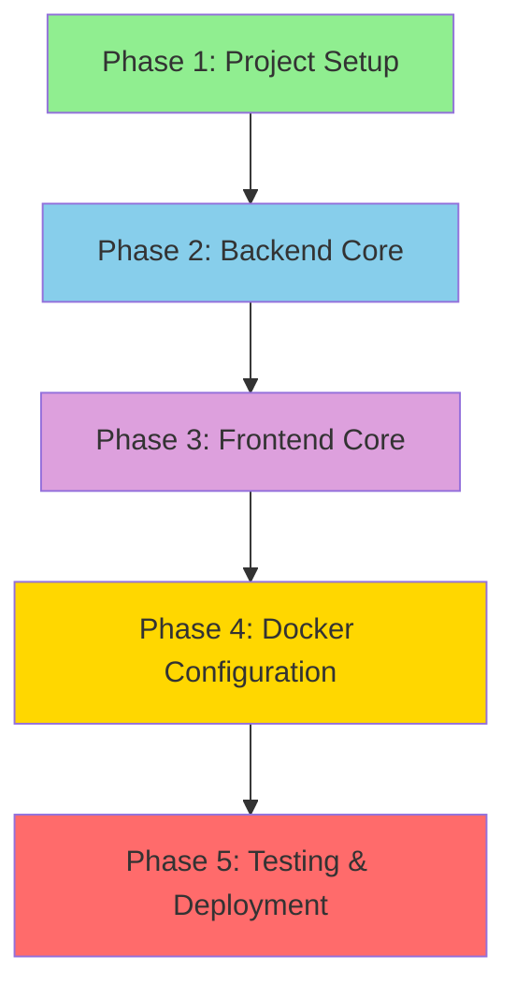
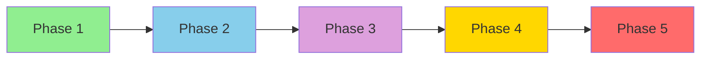

# 🏗️ Chore-Ganizer Implementation Plan

Detailed step-by-step implementation plan for building Chore-Ganizer from scratch.

---

## 📋 Overview

This plan breaks down the implementation of Chore-Ganizer into clear, actionable steps. Each step can be completed independently and verified before moving to the next.

**Project Status:** Planning Phase (Documentation Complete, No Code Yet)  
**Target:** Full MVP Implementation  
**Estimated Phases:** 5 Major Phases

## 🧪 Testing Requirements

**Critical Implementation Rules:**

1. **Automated Tests:** Every step must include automated tests
2. **Documentation:** Every step must be documented
3. **Background Processes:** Any process started for testing must run in the background
4. **Cleanup:** Background processes must be stopped/killed after testing or on errors

### Testing Strategy

| Phase | Test Type | Tools |
|-------|-----------|-------|
| Phase 1 | File existence, syntax validation | Shell scripts, linters |
| Phase 2 | Unit tests, API endpoint tests | Jest, Supertest |
| Phase 3 | Component tests, integration tests | Vitest, React Testing Library |
| Phase 4 | Build tests, container tests | Docker build, docker-compose |
| Phase 5 | End-to-end tests | Playwright or Cypress |

### Background Process Management

When starting processes for testing:
```bash
# Start in background with logging
nohup npm run dev > logs/dev.log 2>&1 &

# Save PID for cleanup
echo $! > logs/dev.pid

# Cleanup after testing
if [ -f logs/dev.pid ]; then
    kill $(cat logs/dev.pid)
    rm logs/dev.pid
fi
```

### Documentation Requirements

Each implementation step must include:
- [ ] Code implementation
- [ ] Automated tests
- [ ] Test execution and results
- [ ] Documentation of what was done
- [ ] Verification checklist

---

## 🗺️ Implementation Roadmap



---

## 📦 Phase 1: Project Setup

### Goal: Set up the complete project structure and configuration files

#### 1.1 Create Directory Structure

```bash
# Create main directories
mkdir -p backend/src/{config,middleware,routes,controllers,services,utils,types}
mkdir -p backend/prisma/migrations
mkdir -p frontend/src/{components/{layout,chores,notifications,common},pages,hooks,store,api,types,utils}
mkdir -p frontend/public
mkdir -p data/{uploads,backups}
```

**Verification:** All directories created successfully

#### 1.2 Create Root Configuration Files

**Files to create:**
- [ ] `.gitignore` - Git ignore patterns
- [ ] `.env.example` - Environment variable template
- [ ] `backup.sh` - Backup script (from BACKUP-RESTORE-GUIDE.md)

**Verification:** Files exist in project root

#### 1.3 Initialize Backend

**Files to create:**
- [ ] `backend/package.json` - Backend dependencies and scripts
- [ ] `backend/tsconfig.json` - TypeScript configuration
- [ ] `backend/nodemon.json` - Nodemon configuration for dev
- [ ] `backend/.dockerignore` - Docker ignore patterns
- [ ] `backend/.env.example` - Backend environment template

**Dependencies to install:**
```json
{
  "dependencies": {
    "express": "^4.18.2",
    "cors": "^2.8.5",
    "express-session": "^1.17.3",
    "bcrypt": "^5.1.1",
    "dotenv": "^16.3.1",
    "zod": "^3.22.4",
    "@prisma/client": "^5.7.1"
  },
  "devDependencies": {
    "@types/node": "^20.10.6",
    "@types/express": "^4.17.21",
    "@types/bcrypt": "^5.0.2",
    "@types/express-session": "^1.17.10",
    "@types/cors": "^2.8.17",
    "typescript": "^5.3.3",
    "ts-node": "^10.9.2",
    "nodemon": "^3.0.2",
    "prisma": "^5.7.1"
  }
}
```

**Verification:** `npm install` completes without errors

#### 1.4 Initialize Frontend

**Files to create:**
- [ ] `frontend/package.json` - Frontend dependencies and scripts
- [ ] `frontend/tsconfig.json` - TypeScript configuration
- [ ] `frontend/tsconfig.node.json` - Node TypeScript config
- [ ] `frontend/vite.config.ts` - Vite configuration
- [ ] `frontend/tailwind.config.js` - Tailwind CSS configuration
- [ ] `frontend/postcss.config.js` - PostCSS configuration
- [ ] `frontend/index.html` - HTML entry point
- [ ] `frontend/.dockerignore` - Docker ignore patterns
- [ ] `frontend/.env.example` - Frontend environment template

**Dependencies to install:**
```json
{
  "dependencies": {
    "react": "^18.2.0",
    "react-dom": "^18.2.0",
    "react-router-dom": "^6.21.1",
    "axios": "^1.6.5",
    "zustand": "^4.4.7",
    "@tanstack/react-query": "^5.17.9",
    "lucide-react": "^0.303.0"
  },
  "devDependencies": {
    "@types/react": "^18.2.47",
    "@types/react-dom": "^18.2.18",
    "@vitejs/plugin-react": "^4.2.1",
    "typescript": "^5.3.3",
    "vite": "^5.0.11",
    "tailwindcss": "^3.4.0",
    "postcss": "^8.4.33",
    "autoprefixer": "^10.4.16"
  }
}
```

**Verification:** `npm install` completes without errors

#### 1.5 Initialize Prisma

**Files to create:**
- [ ] `backend/prisma/schema.prisma` - Database schema

**Schema models:**
```prisma
enum UserRole {
  PARENT
  CHILD
}

enum ChoreStatus {
  PENDING
  COMPLETED
}

enum NotificationType {
  CHORE_ASSIGNED
  CHORE_COMPLETED
  POINTS_EARNED
}

model User {
  id            Int            @id @default(autoincrement())
  email         String         @unique
  password      String
  name          String
  role          UserRole       @default(CHILD)
  points        Int            @default(0)
  createdAt     DateTime       @default(now())
  assignedChores Chore[]       @relation("AssignedChores")
  notifications Notification[]
}

model Chore {
  id          Int        @id @default(autoincrement())
  title       String
  description String?
  points      Int
  status      ChoreStatus @default(PENDING)
  assignedToId Int
  assignedTo  User       @relation("AssignedChores", fields: [assignedToId], references: [id])
  createdAt   DateTime   @default(now())
  completedAt DateTime?
}

model Notification {
  id        Int             @id @default(autoincrement())
  userId    Int
  user      User            @relation(fields: [userId], references: [id])
  type      NotificationType
  title     String
  message   String
  read      Boolean         @default(false)
  createdAt DateTime        @default(now())
}
```

**Commands to run:**
```bash
cd backend
npx prisma generate
npx prisma migrate dev --name init
```

**Verification:** Prisma client generated, migrations created

#### 1.6 Create Seed Data

**Files to create:**
- [ ] `backend/prisma/seed.ts` - Initial data seeding

**Seed data includes:**
- 2 parent users (dad@home, mom@home)
- 2 child users (alice@home, bob@home)
- Sample chores

**Commands to run:**
```bash
cd backend
npx prisma db seed
```

**Verification:** Database seeded with initial data

---

## 🔧 Phase 2: Backend Core

### Goal: Implement the complete backend API

#### 2.1 Backend Configuration

**Files to create:**
- [ ] `backend/src/config/database.ts` - Prisma client configuration
- [ ] `backend/src/types/express.d.ts` - Express TypeScript extensions
- [ ] `backend/src/types/session.d.ts` - Session TypeScript extensions

**Verification:** TypeScript types compile without errors

#### 2.2 Middleware

**Files to create:**
- [ ] `backend/src/middleware/auth.ts` - Authentication middleware
- [ ] `backend/src/middleware/roleCheck.ts` - Role-based access control
- [ ] `backend/src/middleware/validator.ts` - Request validation with Zod
- [ ] `backend/src/middleware/errorHandler.ts` - Global error handling
- [ ] `backend/src/utils/asyncHandler.ts` - Async error wrapper

**Verification:** Middleware files compile without errors

#### 2.3 Services (Business Logic)

**Files to create:**
- [ ] `backend/src/services/auth.service.ts` - Authentication logic
- [ ] `backend/src/services/chores.service.ts` - Chore CRUD operations
- [ ] `backend/src/services/points.service.ts` - Points calculation
- [ ] `backend/src/services/notifications.service.ts` - Notification management

**Verification:** Service files compile without errors

#### 2.4 Controllers (Request Handlers)

**Files to create:**
- [ ] `backend/src/controllers/auth.controller.ts` - Auth endpoints
- [ ] `backend/src/controllers/chores.controller.ts` - Chore endpoints
- [ ] `backend/src/controllers/users.controller.ts` - User endpoints
- [ ] `backend/src/controllers/notifications.controller.ts` - Notification endpoints
- [ ] `backend/src/controllers/health.controller.ts` - Health check endpoint

**Verification:** Controller files compile without errors

#### 2.5 Routes

**Files to create:**
- [ ] `backend/src/routes/auth.routes.ts` - Auth routes
- [ ] `backend/src/routes/chores.routes.ts` - Chore routes
- [ ] `backend/src/routes/users.routes.ts` - User routes
- [ ] `backend/src/routes/notifications.routes.ts` - Notification routes
- [ ] `backend/src/routes/index.ts` - Route aggregator

**Verification:** Route files compile without errors

#### 2.6 Application Setup

**Files to create:**
- [ ] `backend/src/app.ts` - Express app configuration
- [ ] `backend/src/server.ts` - Server entry point

**App configuration includes:**
- CORS setup
- Session middleware
- JSON parsing
- Route mounting
- Error handling
- Health check endpoint

**Verification:** Server starts without errors on port 3000

#### 2.7 Backend Testing

**Manual testing checklist:**
- [ ] Health check: `GET /health` returns 200
- [ ] Login: `POST /api/auth/login` works
- [ ] Get current user: `GET /api/auth/me` works
- [ ] Create chore: `POST /api/chores` works (parent only)
- [ ] Get chores: `GET /api/chores` works
- [ ] Complete chore: `POST /api/chores/:id/complete` works
- [ ] Get notifications: `GET /api/notifications` works

**Verification:** All API endpoints work as documented in API-DOCUMENTATION.md

---

## 🎨 Phase 3: Frontend Core

### Goal: Implement the complete React frontend

#### 3.1 Frontend Configuration

**Files to create:**
- [ ] `frontend/src/index.css` - Global styles with Tailwind
- [ ] `frontend/src/main.tsx` - React entry point
- [ ] `frontend/src/App.tsx` - Root component with routing

**Verification:** Frontend builds without errors

#### 3.2 API Client

**Files to create:**
- [ ] `frontend/src/api/client.ts` - Axios instance with interceptors
- [ ] `frontend/src/api/auth.api.ts` - Auth API calls
- [ ] `frontend/src/api/chores.api.ts` - Chore API calls
- [ ] `frontend/src/api/users.api.ts` - User API calls
- [ ] `frontend/src/api/notifications.api.ts` - Notification API calls

**Verification:** API client configured with base URL and cookie handling

#### 3.3 State Management

**Files to create:**
- [ ] `frontend/src/store/authStore.ts` - Auth state with Zustand
- [ ] `frontend/src/types/chore.types.ts` - Chore type definitions
- [ ] `frontend/src/types/user.types.ts` - User type definitions
- [ ] `frontend/src/types/notification.types.ts` - Notification type definitions

**Verification:** State management compiles without errors

#### 3.4 Custom Hooks

**Files to create:**
- [ ] `frontend/src/hooks/useAuth.ts` - Auth hook
- [ ] `frontend/src/hooks/useChores.ts` - Chores hook with React Query
- [ ] `frontend/src/hooks/useNotifications.ts` - Notifications hook
- [ ] `frontend/src/hooks/useUser.ts` - User data hook

**Verification:** Hooks compile without errors

#### 3.5 Common Components

**Files to create:**
- [ ] `frontend/src/components/common/Button.tsx` - Reusable button
- [ ] `frontend/src/components/common/Input.tsx` - Reusable input
- [ ] `frontend/src/components/common/Modal.tsx` - Modal component
- [ ] `frontend/src/components/common/Loading.tsx` - Loading spinner
- [ ] `frontend/src/components/common/ErrorBoundary.tsx` - Error boundary

**Verification:** Components render without errors

#### 3.6 Layout Components

**Files to create:**
- [ ] `frontend/src/components/layout/Navbar.tsx` - Navigation bar
- [ ] `frontend/src/components/layout/Sidebar.tsx` - Sidebar navigation
- [ ] `frontend/src/components/layout/Footer.tsx` - Footer component

**Verification:** Layout components render without errors

#### 3.7 Chore Components

**Files to create:**
- [ ] `frontend/src/components/chores/ChoreCard.tsx` - Single chore display
- [ ] `frontend/src/components/chores/ChoreForm.tsx` - Chore create/edit form
- [ ] `frontend/src/components/chores/ChoreList.tsx` - List of chores
- [ ] `frontend/src/components/chores/ChoreFilters.tsx` - Filter controls

**Verification:** Chore components render without errors

#### 3.8 Notification Components

**Files to create:**
- [ ] `frontend/src/components/notifications/NotificationBell.tsx` - Notification icon
- [ ] `frontend/src/components/notifications/NotificationList.tsx` - Notification dropdown

**Verification:** Notification components render without errors

#### 3.9 Page Components

**Files to create:**
- [ ] `frontend/src/pages/Login.tsx` - Login page
- [ ] `frontend/src/pages/Dashboard.tsx` - Main dashboard
- [ ] `frontend/src/pages/Chores.tsx` - Chores management page
- [ ] `frontend/src/pages/Profile.tsx` - User profile page
- [ ] `frontend/src/pages/NotFound.tsx` - 404 page

**Verification:** Pages render without errors

#### 3.10 Frontend Testing

**Manual testing checklist:**
- [ ] Login page loads and submits correctly
- [ ] Dashboard displays user info and points
- [ ] Chores page shows assigned chores
- [ ] Parents can create, edit, delete chores
- [ ] Children can only view and complete chores
- [ ] Notifications appear and can be marked as read
- [ ] Responsive design works on mobile

**Verification:** All frontend features work as expected

---

## 🐳 Phase 4: Docker Configuration

### Goal: Set up Docker for production deployment

#### 4.1 Backend Dockerfile

**Files to create:**
- [ ] `backend/Dockerfile` - Production backend Dockerfile
- [ ] `backend/Dockerfile.dev` - Development backend Dockerfile (optional)

**Verification:** Docker image builds successfully

#### 4.2 Frontend Dockerfile

**Files to create:**
- [ ] `frontend/Dockerfile` - Production frontend Dockerfile
- [ ] `frontend/Dockerfile.dev` - Development frontend Dockerfile (optional)

**Verification:** Docker image builds successfully

#### 4.3 Nginx Configuration

**Files to create:**
- [ ] `frontend/nginx.conf` - Nginx configuration for frontend

**Verification:** Nginx config is valid

#### 4.4 Docker Compose

**Files to create:**
- [ ] `docker-compose.yml` - Production Docker Compose configuration
- [ ] `docker-compose.dev.yml` - Development Docker Compose configuration (optional)

**Verification:** Docker Compose configuration is valid

#### 4.5 Environment Configuration

**Files to create:**
- [ ] `.env` - Production environment variables (from .env.example)
- [ ] `backend/.env` - Backend environment variables
- [ ] `frontend/.env` - Frontend environment variables

**Verification:** Environment variables are set correctly

#### 4.6 Docker Testing

**Testing checklist:**
- [ ] `docker-compose build` completes without errors
- [ ] `docker-compose up -d` starts containers successfully
- [ ] `docker-compose ps` shows both containers as "Up"
- [ ] Backend health check passes: `curl http://localhost:3000/health`
- [ ] Frontend is accessible: `curl http://localhost:3001/`
- [ ] Application works end-to-end in Docker

**Verification:** Docker deployment works correctly

---

## 🧪 Phase 5: Testing & Deployment

### Goal: Final testing and production deployment

#### 5.1 Integration Testing

**Testing checklist:**
- [ ] Login as parent works
- [ ] Login as child works
- [ ] Parents can create chores
- [ ] Parents can edit chores
- [ ] Parents can delete chores
- [ ] Children can view assigned chores
- [ ] Children can complete chores
- [ ] Points are awarded correctly
- [ ] Notifications appear correctly
- [ ] Session persistence works
- [ ] Role-based access control works

**Verification:** All features work end-to-end

#### 5.2 Cross-Device Testing

**Testing checklist:**
- [ ] Works on desktop browser
- [ ] Works on tablet
- [ ] Works on mobile phone
- [ ] Responsive design looks good on all devices
- [ ] Touch interactions work on mobile

**Verification:** Application is fully responsive

#### 5.3 Security Verification

**Security checklist:**
- [ ] SESSION_SECRET is strong (32+ characters)
- [ ] Default passwords changed in seed.ts
- [ ] .env file is not committed to git
- [ ] Database file is not committed to git
- [ ] CORS is properly configured
- [ ] Passwords are hashed with bcrypt
- [ ] Sessions expire correctly

**Verification:** Security best practices are followed

#### 5.4 Backup Testing

**Testing checklist:**
- [ ] Backup script runs successfully
- [ ] Backup file is created
- [ ] Backup integrity check passes
- [ ] Restore from backup works
- [ ] Data is intact after restore

**Verification:** Backup and restore procedures work

#### 5.5 Production Deployment

**Deployment checklist:**
- [ ] Server requirements met (Docker, Docker Compose)
- [ ] Ports 3000 and 3001 are available
- [ ] Firewall configured (if needed)
- [ ] Application deployed to server
- [ ] Database migrations run
- [ ] Seed data loaded
- [ ] Application accessible from network
- [ ] Family members can login
- [ ] All features work in production

**Verification:** Application is deployed and working in production

#### 5.6 Documentation Updates

**Documentation checklist:**
- [ ] Update README with deployment URL
- [ ] Document any customizations made
- [ ] Create family user guide
- [ ] Document backup schedule
- [ ] Document any known issues

**Verification:** Documentation is complete and up to date

---

## 📊 Implementation Summary

### Files to Create

| Category | Count |
|----------|-------|
| Backend files | ~30 |
| Frontend files | ~35 |
| Docker files | ~5 |
| Configuration files | ~10 |
| **Total** | **~80 files** |

### Estimated Implementation Order

1. **Phase 1: Project Setup** - Foundation
2. **Phase 2: Backend Core** - API implementation
3. **Phase 3: Frontend Core** - UI implementation
4. **Phase 4: Docker Configuration** - Containerization
5. **Phase 5: Testing & Deployment** - Final verification

### Dependencies Between Phases



---

## ✅ Completion Criteria

The implementation is complete when:

- [ ] All 80+ files are created
- [ ] Backend API matches API-DOCUMENTATION.md
- [ ] Frontend implements all features
- [ ] Docker deployment works
- [ ] All tests pass
- [ ] Application is deployed and accessible
- [ ] Family members can use the application
- [ ] Backups are configured and working
- [ ] Documentation is complete

---

## 📚 Reference Documentation

During implementation, refer to:

- [API-DOCUMENTATION.md](./API-DOCUMENTATION.md) - API endpoint specifications
- [DOCKER-CONFIGURATION.md](./DOCKER-CONFIGURATION.md) - Docker setup details
- [POST-DEPLOYMENT-GUIDE.md](./POST-DEPLOYMENT-GUIDE.md) - Post-deployment operations
- [BACKUP-RESTORE-GUIDE.md](./BACKUP-RESTORE-GUIDE.md) - Backup procedures
- [CHORE-GANIZER-DEVELOPMENT-PLAN.md](./CHORE-GANIZER-DEVELOPMENT-PLAN.md) - Detailed implementation guide

---

**Last Updated:** February 2026  
**Version:** 2.0.0
