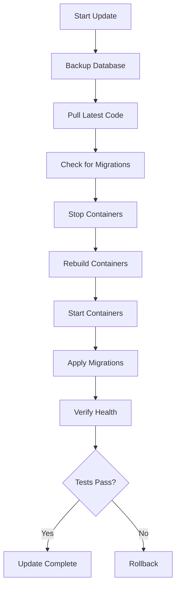

# 🚀 Chore-Ganizer Post-Deployment Guide

Guide for managing and maintaining Chore-Ganizer after initial deployment.

---

## 📋 Table of Contents

1. [Daily Operations](#daily-operations)
2. [User Management](#user-management)
3. [Updating the Application](#updating-the-application)
4. [Rollback Procedures](#rollback-procedures)
5. [Disaster Recovery](#disaster-recovery)
6. [Monitoring and Maintenance](#monitoring-and-maintenance)
7. [Troubleshooting Common Issues](#troubleshooting-common-issues)

---

## 🔄 Daily Operations

### Starting the Application

```bash
cd /path/to/chore-ganizer
docker-compose up -d
```

### Stopping the Application

```bash
docker-compose down
```

### Checking Application Status

```bash
# Check if containers are running
docker-compose ps

# Check backend health
curl http://localhost:3000/health

# Check frontend accessibility
curl -I http://localhost:3001/
```

### Viewing Logs

```bash
# All services (live)
docker-compose logs -f

# Backend only
docker-compose logs -f backend

# Frontend only
docker-compose logs -f frontend

# Last 100 lines
docker-compose logs --tail=100
```

---

## 👥 User Management

### Adding New Family Members

After initial deployment, you can add new family members by editing the seed file and reseeding the database.

**Step 1: Edit the seed file**

```bash
nano backend/prisma/seed.ts
```

Add a new user to the users array:

```typescript
await prisma.user.create({
  data: {
    email: 'charlie@home',
    password: await bcrypt.hash('secure-password', 10),
    name: 'Charlie',
    role: UserRole.CHILD,
    points: 0,
  },
});
```

**Step 2: Reseed the database**

```bash
docker-compose exec backend npx prisma db seed
```

**Step 3: Verify the new user**

```bash
docker-compose exec backend npx prisma studio
# Open http://localhost:5555 and check the User table
```

### Changing User Passwords

**Step 1: Generate a new password hash**

```bash
docker-compose exec backend node -e "
const bcrypt = require('bcrypt');
bcrypt.hash('new-password', 10).then(hash => console.log(hash));
"
```

**Step 2: Update the user in the database**

```bash
docker-compose exec backend npx prisma studio
# Open http://localhost:5555
# Navigate to User table
# Find the user and update the password field with the new hash
```

**Alternative: Edit seed.ts and reseed**

```bash
nano backend/prisma/seed.ts
# Update the password for the user
docker-compose exec backend npx prisma db seed
```

### Changing User Roles

```bash
docker-compose exec backend npx prisma studio
# Open http://localhost:5555
# Navigate to User table
# Find the user and change role from CHILD to PARENT or vice versa
```

### Removing a Family Member

**⚠️ Warning: This will permanently delete the user and all their data.**

```bash
docker-compose exec backend npx prisma studio
# Open http://localhost:5555
# Navigate to User table
# Find the user and delete them
```

**Note:** You may want to reassign their chores before deletion.

---

## 🔄 Updating the Application

### Pre-Update Checklist

Before updating, always:

- [ ] Create a backup of the database
- [ ] Note the current version
- [ ] Check the release notes for breaking changes
- [ ] Schedule a maintenance window if needed

### Update Procedure

**Step 1: Backup the database**

```bash
./backup.sh
```

**Step 2: Pull the latest code**

```bash
git pull origin main
```

**Step 3: Check for new migrations**

```bash
docker-compose exec backend npx prisma migrate status
```

**Step 4: Stop the application**

```bash
docker-compose down
```

**Step 5: Rebuild and start containers**

```bash
docker-compose up -d --build
```

**Step 6: Apply any new migrations**

```bash
docker-compose exec backend npx prisma migrate deploy
```

**Step 7: Verify the update**

```bash
# Check container status
docker-compose ps

# Check backend health
curl http://localhost:3000/health

# Check logs for errors
docker-compose logs --tail=50
```

**Step 8: Test the application**

- Login as a parent
- Create a test chore
- Login as a child
- Complete the test chore
- Verify points are awarded

### Update Workflow Diagram



---

## ⏪ Rollback Procedures

### Scenario 1: Database Migration Failed

**Step 1: Stop the backend**

```bash
docker-compose stop backend
```

**Step 2: Restore the database from backup**

```bash
# Find the latest backup
ls -lht data/backups/ | head -5

# Restore
gunzip -c data/backups/chores_YYYYMMDD_HHMMSS.db.gz > data/chores.db
```

**Step 3: Start the backend**

```bash
docker-compose start backend
```

**Step 4: Verify**

```bash
docker-compose logs backend --tail=50
curl http://localhost:3000/health
```

### Scenario 2: Application Update Failed

**Step 1: Stop all containers**

```bash
docker-compose down
```

**Step 2: Revert to previous commit**

```bash
git log --oneline -5
# Note the commit hash you want to revert to
git checkout <commit-hash>
```

**Step 3: Rebuild containers**

```bash
docker-compose up -d --build
```

**Step 4: Restore database if needed**

```bash
gunzip -c data/backups/chores_YYYYMMDD_HHMMSS.db.gz > data/chores.db
```

**Step 5: Verify**

```bash
docker-compose ps
curl http://localhost:3000/health
```

### Scenario 3: Complete System Failure

**Step 1: Stop all containers**

```bash
docker-compose down
```

**Step 2: Remove corrupted containers**

```bash
docker-compose rm -f
```

**Step 3: Restore database from backup**

```bash
gunzip -c data/backups/chores_YYYYMMDD_HHMMSS.db.gz > data/chores.db
```

**Step 4: Rebuild from scratch**

```bash
docker-compose up -d --build
```

**Step 5: Run migrations**

```bash
docker-compose exec backend npx prisma migrate deploy
```

**Step 6: Verify**

```bash
docker-compose ps
docker-compose logs --tail=100
curl http://localhost:3000/health
```

---

## 🆘 Disaster Recovery

### Complete System Recovery

If the entire system is lost (server failure, data corruption), follow these steps:

**Step 1: Set up a new server**

- Install Docker and Docker Compose
- Configure firewall (allow ports 3000 and 3001)
- Ensure sufficient disk space

**Step 2: Clone the repository**

```bash
git clone <your-repo-url> chore-ganizer
cd chore-ganizer
```

**Step 3: Restore configuration**

```bash
# Copy your .env file from backup
cp /path/to/backup/.env .

# Create data directories
mkdir -p data/backups data/uploads
chmod 755 data data/backups data/uploads
```

**Step 4: Restore database**

```bash
# Copy your database backup
cp /path/to/backup/chores_YYYYMMDD_HHMMSS.db.gz data/backups/

# Restore
gunzip -c data/backups/chores_YYYYMMDD_HHMMSS.db.gz > data/chores.db
```

**Step 5: Start the application**

```bash
docker-compose up -d --build
```

**Step 6: Verify**

```bash
docker-compose ps
curl http://localhost:3000/health
```

**Step 7: Test with family**

- Have family members login
- Verify all data is intact
- Check chore history
- Verify points balances

### Off-Site Backup Strategy

For maximum safety, implement off-site backups:

**Option 1: rsync to remote server**

```bash
# Add to crontab
0 2 * * * rsync -avz /path/to/chore-ganizer/data/backups/ user@remote-server:/backups/chore-ganizer/
```

**Option 2: Cloud storage (rclone)**

```bash
# Install rclone
# Configure cloud storage (S3, Google Drive, etc.)

# Add to crontab
0 2 * * * rclone sync /path/to/chore-ganizer/data/backups/ remote:chore-ganizer-backups/
```

**Option 3: Automated backup service**

- Use services like Backblaze B2, Wasabi, or similar
- Configure automated uploads via their API

---

## 📊 Monitoring and Maintenance

### Daily Checks

```bash
# Check if containers are running
docker-compose ps

# Check for errors in logs
docker-compose logs --tail=100 | grep -i error

# Check disk space
df -h
```

### Weekly Tasks

```bash
# Review recent activity
docker-compose logs --since 7d

# Check database size
ls -lh data/chores.db

# Verify backups are running
ls -lht data/backups/ | head -10

# Check for unused Docker resources
docker system df
```

### Monthly Tasks

```bash
# Clean up old Docker images
docker image prune -a -f

# Clean up old backups (keep last 30 days)
find data/backups/ -name "*.db.gz" -mtime +30 -delete

# Review and update dependencies (if needed)
cd backend && npm outdated
cd ../frontend && npm outdated

# Check for security updates
docker scan chore-backend:latest
docker scan chore-frontend:latest
```

### Performance Monitoring

**Check container resource usage:**

```bash
docker stats chore-backend chore-frontend
```

**Check database performance:**

```bash
# Open Prisma Studio
docker-compose exec backend npx prisma studio

# Check for slow queries (if using SQLite with logging)
docker-compose logs backend | grep -i "slow"
```

**Check response times:**

```bash
# Backend health check
time curl http://localhost:3000/health

# Frontend load time
time curl -I http://localhost:3001/
```

---

## 🔧 Troubleshooting Common Issues

### Issue: Containers won't start

**Symptoms:** `docker-compose ps` shows containers as "Exited" or "Restarting"

**Diagnosis:**

```bash
# Check logs
docker-compose logs backend
docker-compose logs frontend

# Check for port conflicts
sudo netstat -tulpn | grep -E ':(3000|3001)'
```

**Solutions:**

1. **Port conflict:** Change ports in `.env` or stop conflicting services
2. **Missing .env:** Ensure `.env` file exists and is properly configured
3. **Database locked:** Restart backend container
4. **Permission issues:** Fix data directory permissions

```bash
chmod 755 data data/backups data/uploads
chown -R 1000:1000 data
```

### Issue: Users can't login

**Symptoms:** Login fails with "Invalid credentials" error

**Diagnosis:**

```bash
# Check if user exists
docker-compose exec backend npx prisma studio
# Open http://localhost:5555 and check User table

# Check backend logs
docker-compose logs backend | grep -i login
```

**Solutions:**

1. **Wrong password:** Reset password using the procedure above
2. **Session issues:** Clear browser cookies and try again
3. **Database corruption:** Restore from backup

### Issue: Chores not saving

**Symptoms:** Creating/editing chores fails silently or with error

**Diagnosis:**

```bash
# Check backend logs
docker-compose logs backend | grep -i error

# Check database write permissions
ls -la data/chores.db
```

**Solutions:**

1. **Database locked:** Restart backend container
2. **Permission denied:** Fix database file permissions
3. **Validation error:** Check request data format

### Issue: Points not updating

**Symptoms:** Completing chores doesn't award points

**Diagnosis:**

```bash
# Check backend logs
docker-compose logs backend | grep -i points

# Check database directly
docker-compose exec backend npx prisma studio
```

**Solutions:**

1. **Transaction failed:** Check for database errors
2. **Race condition:** Try completing chore again
3. **Code bug:** Check GitHub issues for known problems

### Issue: High memory usage

**Symptoms:** Server becomes slow or unresponsive

**Diagnosis:**

```bash
# Check container stats
docker stats

# Check system resources
free -h
df -h
```

**Solutions:**

1. **Restart containers:** `docker-compose restart`
2. **Clean up Docker:** `docker system prune -a`
3. **Add more resources:** Upgrade server if needed
4. **Check for memory leaks:** Monitor over time

### Issue: Can't access from other devices

**Symptoms:** App works on server but not from phone/tablet

**Diagnosis:**

```bash
# Check firewall
sudo ufw status

# Check if ports are listening
sudo netstat -tulpn | grep -E ':(3000|3001)'

# Check CORS settings
docker-compose exec backend printenv CORS_ORIGIN
```

**Solutions:**

1. **Firewall blocking:** Allow ports through firewall
2. **Wrong CORS origin:** Update `CORS_ORIGIN` in `.env`
3. **Wrong URL:** Use server IP instead of localhost

---

## 📞 Getting Help

If you encounter issues not covered here:

1. **Check logs:** `docker-compose logs -f`
2. **Check health:** `curl http://localhost:3000/health`
3. **View database:** `docker-compose exec backend npx prisma studio`
4. **Review documentation:**
   - [README.md](./README.md)
   - [Development Plan](./CHORE-GANIZER-DEVELOPMENT-PLAN.md)
   - [Quick Reference](./QUICK-REFERENCE.md)
   - [API Documentation](./API-DOCUMENTATION.md)
5. **Check GitHub issues:** Search for similar problems

---

**Last Updated:** February 2026  
**Version:** 2.0.0
