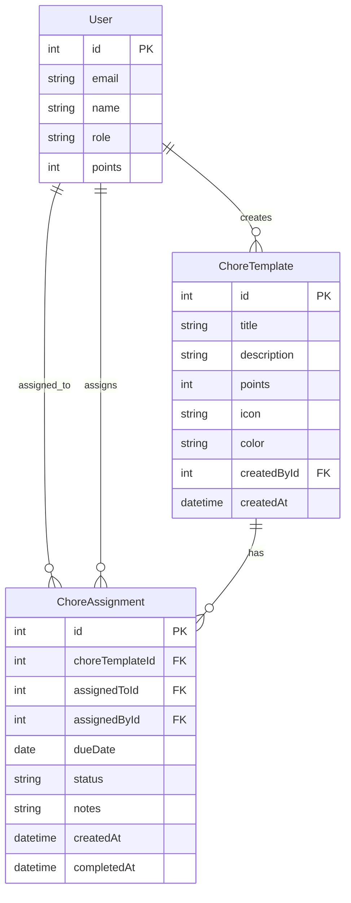

# Chore-Ganizer Refactoring Plan: Templates & Assignments

## Overview

This document outlines the plan to refactor the chore system from one-time tasks to reusable chore templates with assignable instances.

## Current Architecture

```
Chore (one-time task)
├── id
├── title
├── description
├── points
├── status (PENDING | COMPLETED)
├── assignedToId
├── createdAt
└── completedAt
```

**Problem**: Each chore is a single instance. To repeat "Wash dishes", you must create a new chore every time.

## Proposed Architecture

### New Data Model

```
ChoreTemplate (reusable definition)
├── id
├── title
├── description
├── points
├── icon (optional, for UI)
├── color (optional, for UI)
├── createdById
├── createdAt
└── updatedAt

ChoreAssignment (instance assigned to a person)
├── id
├── choreTemplateId → ChoreTemplate
├── assignedToId → User
├── assignedById → User (parent who assigned)
├── dueDate (date when chore should be done)
├── status (PENDING | COMPLETED)
├── notes (optional, for this specific instance)
├── createdAt
└── completedAt
```

### Key Changes

1. **ChoreTemplate**: Defines what the chore is (title, description, points)
2. **ChoreAssignment**: Links a template to a person with a due date
3. **Due dates**: Enable calendar view and overdue tracking
4. **Reusable**: Same template can be assigned multiple times

## API Changes

### New Endpoints

#### Chore Templates
- `GET /api/chore-templates` - List all templates
- `POST /api/chore-templates` - Create template (parents only)
- `PUT /api/chore-templates/:id` - Update template
- `DELETE /api/chore-templates/:id` - Delete template

#### Chore Assignments
- `GET /api/chore-assignments` - List assignments (filterable by user, date range, status)
- `POST /api/chore-assignments` - Assign chore to person with due date
- `PUT /api/chore-assignments/:id` - Update assignment (reschedule, reassign)
- `POST /api/chore-assignments/:id/complete` - Mark as complete
- `DELETE /api/chore-assignments/:id` - Delete assignment

### Deprecated Endpoints
- `POST /api/chores` - Replaced by template + assignment flow
- All `/api/chores/*` endpoints will be deprecated

## UI Changes

### New Pages/Components

1. **Chore Templates Page** (`/chores/templates`)
   - Grid/list view of all chore templates
   - Create, edit, delete templates
   - Show point values and descriptions

2. **Assign Chore Modal**
   - Select template from dropdown
   - Select person to assign
   - Pick due date (date picker)
   - Optional notes

3. **Calendar View** (`/calendar`)
   - Monthly calendar showing assignments by due date
   - Color-coded by status (pending, completed, overdue)
   - Click on day to see assignments
   - Drag-and-drop to reschedule (future)

4. **Updated Dashboard**
   - Show upcoming assignments (next 7 days)
   - Show overdue assignments
   - Quick assign button

### Component Flow

```
Dashboard
├── Upcoming Assignments (next 7 days)
├── Overdue Assignments
└── Quick Assign Button

Chores Page
├── Tab: My Assignments
├── Tab: All Assignments
└── Tab: Templates (parents only)

Calendar Page
├── Month view
├── Week view (optional)
└── Assignment details on click
```

## Database Migration

### Step 1: Create New Tables
```sql
-- Create ChoreTemplate table
CREATE TABLE ChoreTemplate (
  id INTEGER PRIMARY KEY AUTOINCREMENT,
  title TEXT NOT NULL,
  description TEXT,
  points INTEGER NOT NULL,
  icon TEXT,
  color TEXT,
  createdById INTEGER NOT NULL REFERENCES User(id),
  createdAt DATETIME DEFAULT CURRENT_TIMESTAMP,
  updatedAt DATETIME DEFAULT CURRENT_TIMESTAMP
);

-- Create ChoreAssignment table
CREATE TABLE ChoreAssignment (
  id INTEGER PRIMARY KEY AUTOINCREMENT,
  choreTemplateId INTEGER NOT NULL REFERENCES ChoreTemplate(id) ON DELETE CASCADE,
  assignedToId INTEGER NOT NULL REFERENCES User(id) ON DELETE CASCADE,
  assignedById INTEGER NOT NULL REFERENCES User(id) ON DELETE CASCADE,
  dueDate DATE NOT NULL,
  status TEXT DEFAULT 'PENDING',
  notes TEXT,
  createdAt DATETIME DEFAULT CURRENT_TIMESTAMP,
  completedAt DATETIME
);
```

### Step 2: Migrate Existing Data
```sql
-- Migrate existing chores to templates + assignments
INSERT INTO ChoreTemplate (title, description, points, createdById, createdAt)
SELECT title, description, points, 
       COALESCE(assignedToId, 1) as createdById, -- fallback to first user
       createdAt
FROM Chore;

-- Create assignments from existing chores
INSERT INTO ChoreAssignment (choreTemplateId, assignedToId, assignedById, dueDate, status, createdAt, completedAt)
SELECT 
  ct.id as choreTemplateId,
  c.assignedToId,
  c.assignedToId as assignedById, -- fallback, best guess
  DATE(c.createdAt) as dueDate,
  c.status,
  c.createdAt,
  c.completedAt
FROM Chore c
JOIN ChoreTemplate ct ON ct.title = c.title AND ct.points = c.points;
```

### Step 3: Drop Old Table
```sql
DROP TABLE Chore;
```

## Implementation Phases

### Phase 1: Backend Data Model
1. Update Prisma schema with new models
2. Create migration script
3. Create new services for templates and assignments
4. Create new controllers and routes
5. Update tests

### Phase 2: Backend API
1. Implement template CRUD endpoints
2. Implement assignment CRUD endpoints
3. Add date filtering for calendar view
4. Update notification service

### Phase 3: Frontend Updates
1. Create template management UI
2. Create assignment UI with date picker
3. Update dashboard for upcoming/overdue
4. Create calendar view component

### Phase 4: Migration & Testing
1. Test migration on development data
2. Run all tests
3. Update documentation
4. Deploy

## Design Decisions

1. **Recurring chores**: Future feature. For now, templates can be manually assigned multiple times.
2. **Due times**: Just dates (no times). Due date = end of that day.
3. **Overdue handling**: Show warnings in UI + trigger notifications when overdue.
4. **Template categories**: Not needed for now.
5. **Assignment limits**: No limits on concurrent assignments per person.

## Mermaid Diagram



## File Changes Summary

### Backend Files to Create
- `backend/prisma/migrations/XXX_add_templates_assignments/migration.sql`
- `backend/src/services/chore-templates.service.ts`
- `backend/src/services/chore-assignments.service.ts`
- `backend/src/controllers/chore-templates.controller.ts`
- `backend/src/controllers/chore-assignments.controller.ts`
- `backend/src/routes/chore-templates.routes.ts`
- `backend/src/routes/chore-assignments.routes.ts`

### Backend Files to Modify
- `backend/prisma/schema.prisma` - Add new models
- `backend/src/routes/index.ts` - Register new routes
- `backend/src/services/notifications.service.ts` - Update notification types

### Backend Files to Deprecate
- `backend/src/services/chores.service.ts`
- `backend/src/controllers/chores.controller.ts`
- `backend/src/routes/chores.routes.ts`

### Frontend Files to Create
- `frontend/src/pages/TemplatesPage.tsx`
- `frontend/src/pages/CalendarPage.tsx`
- `frontend/src/components/templates/TemplateList.tsx`
- `frontend/src/components/templates/TemplateForm.tsx`
- `frontend/src/components/assignments/AssignmentList.tsx`
- `frontend/src/components/assignments/AssignmentForm.tsx`
- `frontend/src/components/assignments/AssignModal.tsx`
- `frontend/src/components/calendar/CalendarView.tsx`
- `frontend/src/api/templates.api.ts`
- `frontend/src/api/assignments.api.ts`

### Frontend Files to Modify
- `frontend/src/App.tsx` - Add new routes
- `frontend/src/components/layout/Navbar.tsx` - Add calendar link
- `frontend/src/pages/DashboardPage.tsx` - Show upcoming/overdue
- `frontend/src/types/index.ts` - Add new types

### Frontend Files to Deprecate
- `frontend/src/pages/ChoresPage.tsx`
- `frontend/src/components/chores/*`
- `frontend/src/api/chores.api.ts`

### Documentation to Update
- `docs/API-DOCUMENTATION.md`
- `docs/swagger.json`
- `docs/USER-GUIDE.md`
- `docs/ADMIN-GUIDE.md`

---

# 📅 Calendar View Planning

## Overview

Add a calendar view to visualize chore assignments by due date. This will help families see what's due when and plan accordingly.

## Current State

The backend already has an API endpoint for calendar data:
- `GET /api/chore-assignments/calendar?year=2026&month=2`

Returns:
```json
{
  "year": 2026,
  "month": 2,
  "assignments": [...],
  "days": {
    "1": [...],
    "15": [...]
  }
}
```

The frontend already has a `CalendarView.tsx` component in `frontend/src/components/chores/CalendarView.tsx`.

## Requirements

### Must Have
1. **Monthly Calendar Display** - Show a grid of days for the current month
2. **Assignment Indicators** - Show dots/badges on days with assignments
3. **Assignment Details** - Click on a day to see all assignments for that day
4. **Month Navigation** - Navigate between months
5. **Color Coding** - Different colors for pending/completed/overdue

### Should Have
1. **Today Indicator** - Highlight the current day
2. **Week View** - Optional week view toggle
3. **Assignment Count** - Show number of assignments per day

### Nice to Have
1. **Drag and Drop** - Drag assignments between days (future)
2. **Recurring Chores** - Visual indication of recurring chores (future)

## UI/UX Design

### Layout
```
+------------------------------------------+
|  < February 2026 >                       |
+------------------------------------------+
|  Sun | Mon | Tue | Wed | Thu | Fri | Sat |
+------------------------------------------+
|      |   1 |  2 |  3 |  4 |  5 |   6    |
|      |  ●  |    |    |    |    |        |
+------------------------------------------+
|   7 |   8 |  9 | 10 | 11 | 12 |  13    |
|      |     |    | ●● |    |    |   ●    |
+------------------------------------------+
|  ...                                     |
+------------------------------------------+
```

### Component Structure
```
CalendarPage
├── CalendarHeader (month navigation)
├── CalendarGrid
│   └── CalendarDay (for each day)
│       └── AssignmentIndicator (dots)
├── CalendarDayModal (click on day)
│   └── AssignmentList
└── CalendarLegend (color key)
```

## Implementation Plan

### Phase 1: Backend API (Already Done ✓)
- [x] `GET /api/chore-assignments/calendar` - Returns assignments grouped by day
- [x] Includes `isOverdue` flag on each assignment

### Phase 2: Frontend Calendar Component
1. **Create CalendarPage** - New page at `/calendar` route
2. **Update CalendarView** - Improve existing component
3. **Add Navigation** - Month/year selector
4. **Add Day Details Modal** - Show assignments when clicking a day

### Phase 3: Integration
1. **Add Calendar to Sidebar** - Navigation item
2. **Connect to API** - Use existing `/calendar` endpoint
3. **Style & Polish** - Colors, animations, responsive

## File Changes Required

### New Files
- `frontend/src/pages/CalendarPage.tsx` - Main calendar page

### Files to Modify
- `frontend/src/App.tsx` - Add calendar route
- `frontend/src/components/layout/Sidebar.tsx` - Add calendar nav item
- `frontend/src/components/chores/CalendarView.tsx` - Improve existing component

### API Already Available
- `GET /api/chore-assignments/calendar?year=2026&month=2` - Works

## Technical Details

### API Response Format
```typescript
interface CalendarResponse {
  year: number;
  month: number;
  assignments: ChoreAssignment[];
  days: Record<number, ChoreAssignment[]>; // day number -> assignments
}
```

### Color Scheme
| Status | Color | Usage |
|--------|-------|-------|
| Pending | Yellow (#FBBF24) | Default pending |
| Completed | Green (#22C55E) | Completed |
| Overdue | Red (#EF4444) | Past due date |
| Today | Blue (#3B82F6) | Current day highlight |

## Testing Checklist

- [ ] Calendar displays current month on load
- [ ] Month navigation works (prev/next)
- [ ] Assignments appear on correct days
- [ ] Overdue assignments show in red
- [ ] Clicking a day shows assignment details
- [ ] Responsive on mobile
- [ ] Works for all user roles
