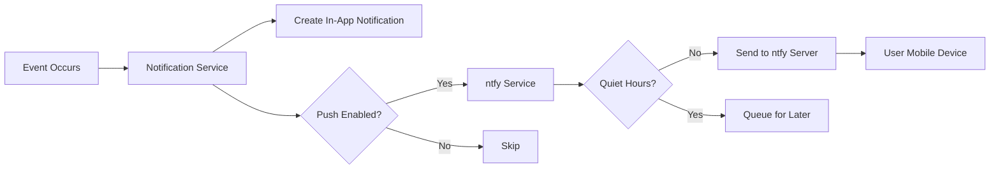

# ntfy Push Notification Integration Plan

## Overview

This document outlines the implementation plan for integrating ntfy push notifications into the chore-ganizer application. ntfy is a simple pub/sub notification service that allows sending push notifications to mobile devices without requiring a complex push notification infrastructure.

### Current State

The application already has an in-app notification system:
- **Notification Model**: Stores notifications in the database with `userId`, `type`, `title`, `message`, `read`, and `createdAt` fields
- **Notification Types**: `CHORE_ASSIGNED`, `POINTS_EARNED`, `OVERDUE_CHORE`
- **Notification Service**: CRUD operations for in-app notifications
- **Triggers**: Notifications are created when chores are assigned, completed, or become overdue

### Goals

1. Send push notifications via ntfy when important events occur
2. Allow users to configure their own ntfy topic for receiving notifications
3. Provide granular control over which notification types are pushed
4. Support quiet hours to avoid disturbing users at inappropriate times

---

## Architecture

### High-Level Flow



### Components

1. **UserNotificationSettings Model** - Stores per-user notification preferences
2. **ntfy Service** - Handles communication with the ntfy server
3. **Enhanced Notification Service** - Coordinates in-app and push notifications
4. **Settings API** - REST endpoints for managing notification preferences
5. **Settings Page** - Frontend UI for configuring notifications

---

## Database Schema Changes

### New Model: UserNotificationSettings

Add a new model to store user-specific notification preferences:

```prisma
model UserNotificationSettings {
  id                        Int       @id @default(autoincrement())
  userId                    Int       @unique
  user                      User      @relation(fields: [userId], references: [id], onDelete: Cascade)
  
  // ntfy configuration
  ntfyTopic                 String?   // User's ntfy topic for push notifications
  ntfyServerUrl             String?   // Optional: custom ntfy server (defaults to app config)
  
  // Notification type toggles
  pushChoreAssigned         Boolean   @default(true)
  pushChoreDueSoon          Boolean   @default(true)
  pushChoreCompleted        Boolean   @default(false)  // For parents when child completes
  pushChoreOverdue          Boolean   @default(true)
  pushPointsEarned          Boolean   @default(false)
  
  // Quiet hours (stored as UTC hours)
  quietHoursEnabled         Boolean   @default(false)
  quietHoursStart           Int?      // Start hour (0-23) in user's timezone
  quietHoursEnd             Int?      // End hour (0-23) in user's timezone
  quietHoursTimezone        String?   // User's timezone for quiet hours
  
  // Reminder settings
  reminderEnabled           Boolean   @default(true)
  reminderHoursBefore       Int       @default(2)  // Hours before due date
  
  createdAt                 DateTime  @default(now())
  updatedAt                 DateTime  @updatedAt
}
```

### Update User Model

Add relation to the existing User model:

```prisma
model User {
  // ... existing fields ...
  notificationSettings      UserNotificationSettings?
}
```

---

## Backend Implementation

### 1. ntfy Service

Create a new service at [`backend/src/services/ntfy.service.ts`](backend/src/services/ntfy.service.ts):

```typescript
interface NtfyConfig {
  serverUrl: string
  topic: string
  title: string
  message: string
  priority?: number  // 1-5, default 3
  tags?: string[]    // Emoji tags for visual identification
  click?: string     // URL to open when notification is clicked
}

export const sendNtfyNotification = async (config: NtfyConfig): Promise<boolean> => {
  // POST to ntfy server
  // Handle errors gracefully (log but don't throw)
}

export const isWithinQuietHours = (settings: UserNotificationSettings): boolean => {
  // Check current time against quiet hours settings
}
```

### 2. Enhanced Notification Service

Update [`backend/src/services/notifications.service.ts`](backend/src/services/notifications.service.ts):

```typescript
export const createNotificationWithPush = async (
  data: NotificationData,
  pushType: PushNotificationType
): Promise<Notification> => {
  // 1. Create in-app notification
  const notification = await createNotification(data)
  
  // 2. Get user's notification settings
  const settings = await getUserNotificationSettings(data.userId)
  
  // 3. Check if push is enabled for this type
  if (shouldSendPush(settings, pushType)) {
    // 4. Check quiet hours
    if (!isWithinQuietHours(settings)) {
      // 5. Send push notification
      await sendPushNotification(settings, data)
    }
  }
  
  return notification
}
```

### 3. Notification Settings Service

Create [`backend/src/services/notification-settings.service.ts`](backend/src/services/notification-settings.service.ts):

```typescript
export const getUserNotificationSettings = async (userId: number): Promise<UserNotificationSettings>
export const upsertNotificationSettings = async (userId: number, data: SettingsData): Promise<UserNotificationSettings>
export const updateNtfyTopic = async (userId: number, topic: string): Promise<UserNotificationSettings>
```

### 4. API Routes

Create [`backend/src/routes/notification-settings.routes.ts`](backend/src/routes/notification-settings.routes.ts):

| Method | Endpoint | Description |
|--------|----------|-------------|
| GET | `/api/notification-settings` | Get current user's settings |
| PUT | `/api/notification-settings` | Update settings |
| POST | `/api/notification-settings/test` | Send test notification |

### 5. Validation Schemas

Add to [`backend/src/schemas/validation.schemas.ts`](backend/src/schemas/validation.schemas.ts):

```typescript
export const notificationSettingsSchema = z.object({
  ntfyTopic: z.string().min(1).max(64).optional().nullable(),
  ntfyServerUrl: z.string().url().optional().nullable(),
  pushChoreAssigned: z.boolean().optional(),
  pushChoreDueSoon: z.boolean().optional(),
  pushChoreCompleted: z.boolean().optional(),
  pushChoreOverdue: z.boolean().optional(),
  pushPointsEarned: z.boolean().optional(),
  quietHoursEnabled: z.boolean().optional(),
  quietHoursStart: z.number().min(0).max(23).optional().nullable(),
  quietHoursEnd: z.number().min(0).max(23).optional().nullable(),
  quietHoursTimezone: z.string().optional().nullable(),
  reminderEnabled: z.boolean().optional(),
  reminderHoursBefore: z.number().min(1).max(72).optional(),
})
```

---

## Notification Triggers

### Events That Trigger Push Notifications

| Event | Notification Type | Recipients | Default Push |
|-------|------------------|------------|--------------|
| Chore assigned | `CHORE_ASSIGNED` | Assigned user | Yes |
| Chore due soon | `CHORE_DUE_SOON` | Assigned user | Yes |
| Chore completed | `CHORE_COMPLETED` | Parents | No |
| Chore overdue | `CHORE_OVERDUE` | Assigned user + Parents | Yes |
| Points earned | `POINTS_EARNED` | User who earned | No |

### Implementation Points

1. **Chore Assigned** - In [`chore-assignments.controller.ts`](backend/src/controllers/chore-assignments.controller.ts) `createAssignment()`
2. **Chore Completed** - In `completeAssignment()` - notify parents
3. **Chore Due Soon** - New scheduled job (cron or on dashboard load)
4. **Chore Overdue** - Existing `createOverdueNotifications()` function

### Scheduled Notifications

Create a new service for scheduled notifications:

```typescript
// backend/src/services/scheduled-notifications.service.ts

export const processDueSoonReminders = async (): Promise<number> => {
  // Find chores due within the reminder window
  // Check if user has reminders enabled
  // Send notifications
}

export const processOverdueNotifications = async (): Promise<number> => {
  // Existing overdue logic, enhanced with push
}
```

---

## Frontend Implementation

### 1. Settings Page Component

Create [`frontend/src/pages/NotificationSettings.tsx`](frontend/src/pages/NotificationSettings.tsx):

```tsx
// Sections:
// 1. ntfy Configuration
//    - Topic input with explanation
//    - Server URL (optional, for self-hosted)
//    - Test notification button

// 2. Notification Types
//    - Toggle switches for each type
//    - Clear descriptions

// 3. Quiet Hours
//    - Enable/disable toggle
//    - Time range picker
//    - Timezone selector

// 4. Reminders
//    - Enable/disable toggle
//    - Hours before due date selector
```

### 2. API Client Updates

Add to [`frontend/src/api/client.ts`](frontend/src/api/client.ts):

```typescript
// Notification Settings API
getNotificationSettings: () => apiClient.get('/notification-settings')
updateNotificationSettings: (data) => apiClient.put('/notification-settings', data)
sendTestNotification: () => apiClient.post('/notification-settings/test')
```

### 3. Navigation Updates

Add settings link to the navbar or profile dropdown.

### 4. User Profile Enhancement

Optionally add a quick link to notification settings from the Profile page.

---

## Configuration

### Environment Variables

Add to backend `.env`:

```env
# ntfy Configuration
NTFY_SERVER_URL=https://ntfy.sh    # Default public server, or self-hosted URL
NTFY_DEFAULT_PRIORITY=3            # Default priority (1-5)
NTFY_ENABLED=true                  # Global enable/disable for push notifications
```

### ntfy Topic Naming Convention

Recommend users create topics with a unique identifier:
- Format: `chore-ganizer-{userId}-{randomSuffix}`
- Example: `chore-ganizer-5-a7b3c`

This ensures:
- Topics are unique per user
- Not easily guessable for security
- Easy to manage and revoke

---

## Security Considerations

1. **Topic Privacy**: ntfy topics are not authenticated by default. Users should:
   - Use unique, hard-to-guess topic names
   - Consider using ntfy's access control features if self-hosting
   - Be aware that anyone with the topic name can send notifications

2. **Server-Side Validation**: 
   - Validate topic names on the server
   - Rate limit notification sends
   - Sanitize notification content

3. **User Control**:
   - Users can disable push notifications entirely
   - Users can change their topic at any time
   - No sensitive data in push notifications (just titles and brief messages)

---

## Implementation Steps

### Phase 1: Database and Backend Foundation

1. [ ] Add `UserNotificationSettings` model to Prisma schema
2. [ ] Run Prisma migration
3. [ ] Create `notification-settings.service.ts`
4. [ ] Create `ntfy.service.ts`
5. [ ] Create validation schemas for settings
6. [ ] Create `notification-settings.routes.ts`
7. [ ] Register routes in `app.ts`

### Phase 2: Integration with Existing Notifications

1. [ ] Update `notifications.service.ts` to support push
2. [ ] Update `chore-assignments.controller.ts` to use enhanced notification service
3. [ ] Add scheduled notification processing for due-soon reminders
4. [ ] Add parent notification when child completes chore

### Phase 3: Frontend Settings Page

1. [ ] Create `NotificationSettings.tsx` page component
2. [ ] Add API client methods for settings
3. [ ] Add route to React Router
4. [ ] Add navigation link to settings
5. [ ] Add test notification functionality

### Phase 4: Testing and Polish

1. [ ] Test all notification types
2. [ ] Test quiet hours functionality
3. [ ] Test scheduled reminders
4. [ ] Update user documentation
5. [ ] Update FUTURE-ROADMAP.md

---

## API Reference

### GET /api/notification-settings

Returns the current user's notification settings.

**Response:**
```json
{
  "success": true,
  "data": {
    "ntfyTopic": "chore-ganizer-5-a7b3c",
    "ntfyServerUrl": null,
    "pushChoreAssigned": true,
    "pushChoreDueSoon": true,
    "pushChoreCompleted": false,
    "pushChoreOverdue": true,
    "pushPointsEarned": false,
    "quietHoursEnabled": true,
    "quietHoursStart": 22,
    "quietHoursEnd": 7,
    "quietHoursTimezone": "America/New_York",
    "reminderEnabled": true,
    "reminderHoursBefore": 2
  }
}
```

### PUT /api/notification-settings

Updates notification settings.

**Request Body:**
```json
{
  "ntfyTopic": "my-new-topic",
  "pushChoreAssigned": false,
  "quietHoursEnabled": true,
  "quietHoursStart": 22,
  "quietHoursEnd": 8
}
```

### POST /api/notification-settings/test

Sends a test notification to verify ntfy configuration.

**Response:**
```json
{
  "success": true,
  "data": {
    "message": "Test notification sent successfully"
  }
}
```

---

## User Guide: Setting Up ntfy

### For Users

1. **Install ntfy app** on your phone:
   - [iOS App Store](https://apps.apple.com/app/ntfy/id1555804271)
   - [Android Play Store](https://play.google.com/store/apps/details?id=io.heckel.ntfy)

2. **Subscribe to a topic**:
   - Open the ntfy app
   - Tap "+" to add a new subscription
   - Enter a unique topic name (e.g., `my-chores-abc123`)
   - Remember this topic name

3. **Configure in Chore-Ganizer**:
   - Go to Settings > Notifications
   - Enter your topic name
   - Click "Test" to verify it works
   - Customize which notifications you want to receive

### For Self-Hosted ntfy

If using a self-hosted ntfy server:
1. Enter the server URL in the settings
2. Ensure the server allows publishing from your Chore-Ganizer instance
3. Configure access control if needed

---

## Future Enhancements

1. **Notification History**: View past push notifications
2. **Batch Notifications**: Daily digest instead of individual notifications
3. **Rich Notifications**: Include chore details, action buttons
4. **Multi-Device Support**: Multiple topics per user
5. **Web Push Fallback**: Browser notifications when mobile app unavailable

---

## References

- [ntfy Documentation](https://docs.ntfy.sh/)
- [ntfy API Reference](https://docs.ntfy.sh/publish/)
- [ntfy Self-Hosting Guide](https://docs.ntfy.sh/install/)

---

*Last updated: February 2026*
