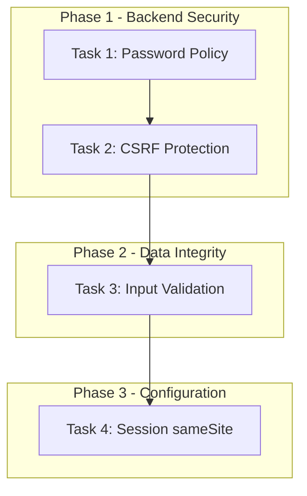

# Phase 6 Production Hardening - Implementation Plan

## Overview

This document outlines the remaining Phase 6 production hardening tasks for Chore-Ganizer. Based on the review of [`FUTURE-ROADMAP.md`](FUTURE-ROADMAP.md) and [`SECURITY-HARDENING.md`](SECURITY-HARDENING.md), the following tasks need to be implemented.

## Summary of Remaining Tasks

| Task | Priority | Status |
|------|----------|--------|
| Password Policy Enforcement | 🔴 High | Pending |
| CSRF Token Protection | 🔴 High | Pending |
| Input Validation Middleware | 🟡 Medium | Partial |
| Session sameSite Configuration | 🟡 Medium | Pending |

---

## Task 1: Password Policy Enforcement

### Description
Implement a comprehensive password policy that enforces minimum security requirements for user passwords during registration and password changes.

### Requirements
- Minimum length: 8 characters
- At least one uppercase letter
- At least one lowercase letter
- At least one number
- At least one special character
- Password strength indicator on frontend

### Files to Modify

#### Backend Files

**1. [`backend/src/middleware/validator.ts`](../backend/src/middleware/validator.ts)**
- Add password validation schema using Zod
- Create reusable password validation rules

```typescript
// Add to existing file
import { z } from 'zod'

export const passwordSchema = z.string()
  .min(8, 'Password must be at least 8 characters')
  .regex(/[A-Z]/, 'Password must contain at least one uppercase letter')
  .regex(/[a-z]/, 'Password must contain at least one lowercase letter')
  .regex(/[0-9]/, 'Password must contain at least one number')
  .regex(/[!@#$%^&*(),.?":{}|<>]/, 'Password must contain at least one special character')

export const registerSchema = z.object({
  email: z.string().email('Invalid email address'),
  password: passwordSchema,
  name: z.string().min(1, 'Name is required').max(100),
  role: z.enum(['PARENT', 'CHILD']).optional().default('CHILD'),
})
```

**2. [`backend/src/routes/auth.routes.ts`](../backend/src/routes/auth.routes.ts)**
- Apply validation middleware to register endpoint

```typescript
// Add validation middleware to register route
import { validate, registerSchema } from '../middleware/validator.js'

router.post('/register', authLimiter, validate(registerSchema), asyncHandler(authController.register))
```

**3. [`backend/src/controllers/auth.controller.ts`](../backend/src/controllers/auth.controller.ts)**
- Remove manual validation (handled by middleware)
- Add password strength score to response (optional)

#### Frontend Files

**4. [`frontend/src/components/common/PasswordStrengthIndicator.tsx`](../frontend/src/components/common/PasswordStrengthIndicator.tsx)** (NEW FILE)
- Create password strength indicator component
- Show real-time feedback as user types
- Display requirements checklist

```typescript
// Component structure
interface PasswordStrengthIndicatorProps {
  password: string
  onStrengthChange?: (strength: number) => void
}

// Requirements to check:
// - Minimum 8 characters
// - Uppercase letter
// - Lowercase letter
// - Number
// - Special character
```

**5. [`frontend/src/pages/Login.tsx`](../frontend/src/pages/Login.tsx)**
- Add registration form toggle
- Integrate PasswordStrengthIndicator component
- Show validation errors from backend

**6. [`frontend/src/pages/Users.tsx`](../frontend/src/pages/Users.tsx)**
- Add password field when creating new users
- Integrate PasswordStrengthIndicator for admin-created users

### Priority Level
🔴 **High Priority** - Critical for production security

---

## Task 2: CSRF Token Protection

### Description
Implement CSRF (Cross-Site Request Forgery) token protection for all state-changing operations (POST, PUT, DELETE).

### Requirements
- Generate CSRF tokens on session creation
- Include token in API responses
- Validate token on state-changing requests
- Configure for same-origin requests

### Files to Modify

#### Backend Files

**1. [`backend/src/middleware/csrf.ts`](../backend/src/middleware/csrf.ts)** (NEW FILE)
- Create CSRF middleware using `csurf` package

```typescript
import csrf from 'csurf'
import { Request, Response, NextFunction } from 'express'

const csrfProtection = csrf({
  cookie: {
    key: '_csrf',
    httpOnly: true,
    secure: process.env.NODE_ENV === 'production',
    sameSite: 'strict',
  }
})

export const csrfMiddleware = csrfProtection

export const getCsrfToken = (req: Request, res: Response) => {
  res.json({
    success: true,
    data: {
      csrfToken: req.csrfToken()
    }
  })
}
```

**2. [`backend/src/app.ts`](../backend/src/app.ts)**
- Add CSRF middleware after session configuration
- Add CSRF token endpoint

```typescript
import { csrfMiddleware, getCsrfToken } from './middleware/csrf.js'

// After session middleware
app.use(csrfMiddleware)

// Add CSRF token endpoint
app.get('/api/csrf-token', getCsrfToken)
```

**3. [`backend/src/routes/index.ts`](../backend/src/routes/index.ts)**
- Exclude health endpoint from CSRF
- Ensure all other routes require CSRF

#### Frontend Files

**4. [`frontend/src/api/client.ts`](../frontend/src/api/client.ts)**
- Fetch CSRF token on initialization
- Include CSRF token in request headers

```typescript
// Add to ApiClient class
private csrfToken: string | null = null

async initCsrfToken() {
  const response = await this.get<{ csrfToken: string }>('/csrf-token')
  this.csrfToken = response.data.csrfToken
}

// Modify request interceptor to include CSRF token
this.client.interceptors.request.use(
  (config) => {
    if (this.csrfToken && ['post', 'put', 'delete', 'patch'].includes(config.method || '')) {
      config.headers['X-CSRF-Token'] = this.csrfToken
    }
    return config
  }
)
```

**5. [`frontend/src/hooks/useAuth.ts`](../frontend/src/hooks/useAuth.ts)**
- Initialize CSRF token on app load

### Dependencies to Install

```bash
# Backend
cd backend
npm install csurf @types/csurf
```

### Priority Level
🔴 **High Priority** - Critical for production security

---

## Task 3: Input Validation Middleware

### Description
Implement comprehensive input validation across all API endpoints using Zod schemas.

### Current Status
- Zod validation middleware exists in [`validator.ts`](../backend/src/middleware/validator.ts)
- Not consistently applied to all routes

### Files to Modify

#### Backend Files

**1. [`backend/src/schemas/validation.schemas.ts`](../backend/src/schemas/validation.schemas.ts)** (NEW FILE)
- Create centralized validation schemas

```typescript
import { z } from 'zod'

// User schemas
export const createUserSchema = z.object({
  email: z.string().email(),
  password: z.string().min(8),
  name: z.string().min(1).max(100),
  role: z.enum(['PARENT', 'CHILD']).optional(),
})

export const updateUserSchema = z.object({
  name: z.string().min(1).max(100).optional(),
  email: z.string().email().optional(),
  color: z.string().regex(/^#[0-9A-Fa-f]{6}$/).optional(),
})

// Chore schemas
export const createChoreTemplateSchema = z.object({
  title: z.string().min(1).max(200),
  description: z.string().max(1000).optional(),
  points: z.number().int().min(0).max(1000),
  categoryId: z.number().int().positive().optional(),
})

export const createChoreAssignmentSchema = z.object({
  templateId: z.number().int().positive(),
  userId: z.number().int().positive(),
  dueDate: z.string().datetime().optional(),
})

// ID parameter validation
export const idParamSchema = z.object({
  id: z.string().regex(/^\d+$/).transform(Number),
})
```

**2. Update all route files to use validation:**

- [`backend/src/routes/auth.routes.ts`](../backend/src/routes/auth.routes.ts)
- [`backend/src/routes/users.routes.ts`](../backend/src/routes/users.routes.ts)
- [`backend/src/routes/chore-templates.routes.ts`](../backend/src/routes/chore-templates.routes.ts)
- [`backend/src/routes/chore-assignments.routes.ts`](../backend/src/routes/chore-assignments.routes.ts)
- [`backend/src/routes/chore-categories.routes.ts`](../backend/src/routes/chore-categories.routes.ts)

Example for routes:

```typescript
import { validate } from '../middleware/validator.js'
import { createChoreTemplateSchema, idParamSchema } from '../schemas/validation.schemas.js'

// Apply validation
router.post('/', validate(createChoreTemplateSchema), asyncHandler(controller.create))
router.get('/:id', validate(idParamSchema, 'params'), asyncHandler(controller.getById))
```

### Priority Level
🟡 **Medium Priority** - Important for data integrity

---

## Task 4: Session sameSite Configuration

### Description
Update session cookie configuration to use `sameSite: 'strict'` for enhanced CSRF protection.

### Current Status
- Currently set to `sameSite: 'lax'` in [`app.ts`](../backend/src/app.ts) line 96

### Files to Modify

**1. [`backend/src/app.ts`](../backend/src/app.ts)**

```typescript
// Change line 96 from:
sameSite: 'lax',

// To:
sameSite: 'strict',
```

### Considerations
- `strict` provides better CSRF protection but may cause issues with cross-site navigation
- Users arriving from external links will need to re-authenticate
- Test thoroughly after implementation

### Priority Level
🟡 **Medium Priority** - Security enhancement

---

## Implementation Order



### Recommended Sequence

1. **Task 1: Password Policy Enforcement**
   - Foundation for user security
   - No dependencies on other tasks
   - Can be tested independently

2. **Task 2: CSRF Protection**
   - Critical security measure
   - Should be implemented before extensive testing
   - Requires frontend coordination

3. **Task 3: Input Validation Middleware**
   - Enhances data integrity
   - Can be implemented incrementally
   - Start with auth routes, then expand

4. **Task 4: Session sameSite Configuration**
   - Quick configuration change
   - Test thoroughly after implementation
   - May require user communication

---

## Testing Checklist

### Password Policy Testing
- [ ] Registration rejects weak passwords
- [ ] Registration accepts strong passwords
- [ ] Password strength indicator displays correctly
- [ ] Error messages are clear and helpful
- [ ] Backend validation matches frontend

### CSRF Protection Testing
- [ ] CSRF token is generated on session creation
- [ ] POST/PUT/DELETE requests require CSRF token
- [ ] Invalid CSRF token returns 403 error
- [ ] GET requests work without CSRF token
- [ ] Token refreshes appropriately

### Input Validation Testing
- [ ] All endpoints validate input
- [ ] Validation errors return proper format
- [ ] Edge cases handled correctly
- [ ] SQL injection attempts blocked
- [ ] XSS attempts blocked

### Session Configuration Testing
- [ ] Session cookie has sameSite=strict
- [ ] Cross-site requests are blocked
- [ ] Same-site requests work correctly
- [ ] Session persists appropriately

---

## Dependencies

### Backend Dependencies
```json
{
  "csurf": "^1.11.0",
  "@types/csurf": "^1.11.2"
}
```

### Frontend Dependencies
No new dependencies required (uses existing axios and react)

---

## Rollback Plan

If issues arise after implementation:

1. **Password Policy**: Disable validation temporarily by commenting out middleware
2. **CSRF Protection**: Remove CSRF middleware from app.ts
3. **Input Validation**: Remove validation middleware from specific routes
4. **Session sameSite**: Revert to 'lax' configuration

---

## References

- [OWASP Password Storage Cheat Sheet](https://cheatsheetseries.owasp.org/cheatsheets/Password_Storage_Cheat_Sheet.html)
- [OWASP CSRF Prevention Cheat Sheet](https://cheatsheetseries.owasp.org/cheatsheets/Cross-Site_Request_Forgery_Prevention_Cheat_Sheet.html)
- [Zod Documentation](https://zod.dev/)
- [csurf Package Documentation](https://github.com/expressjs/csurf)

---

*Last updated: February 2026*
