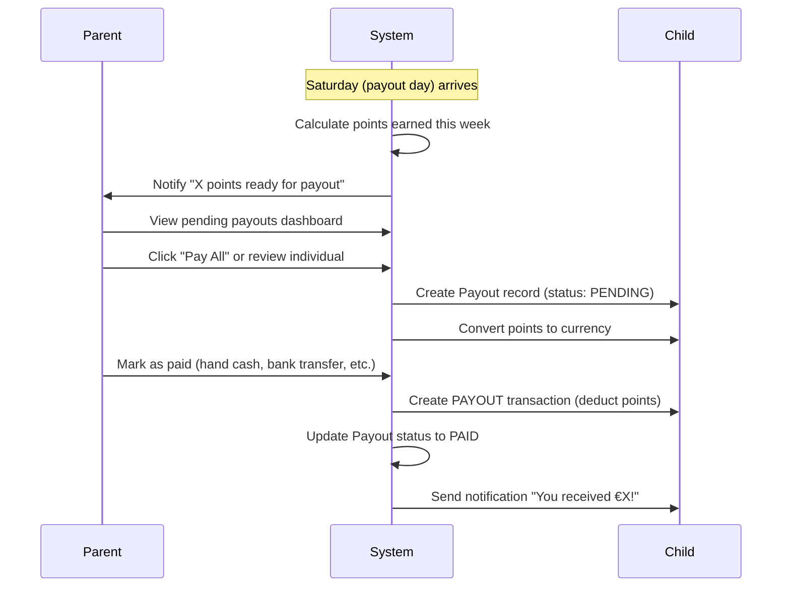
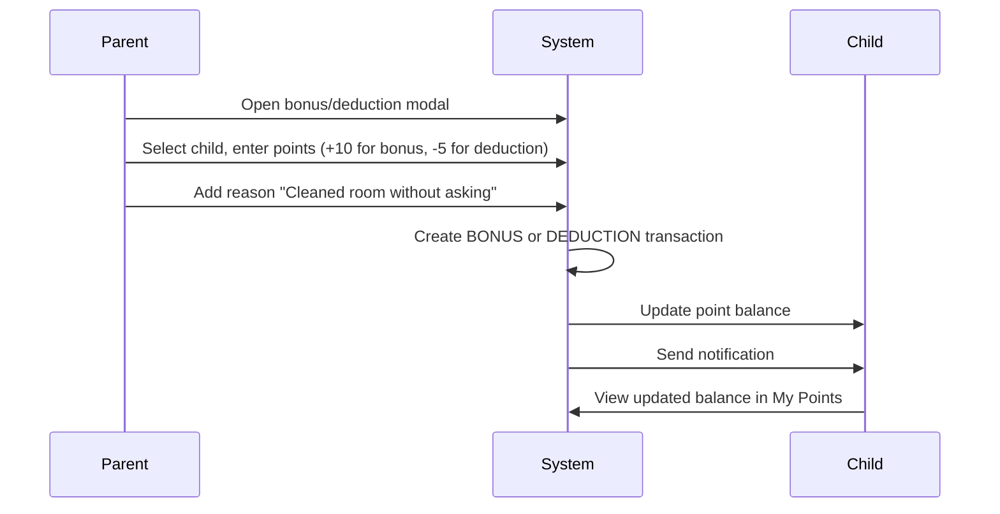
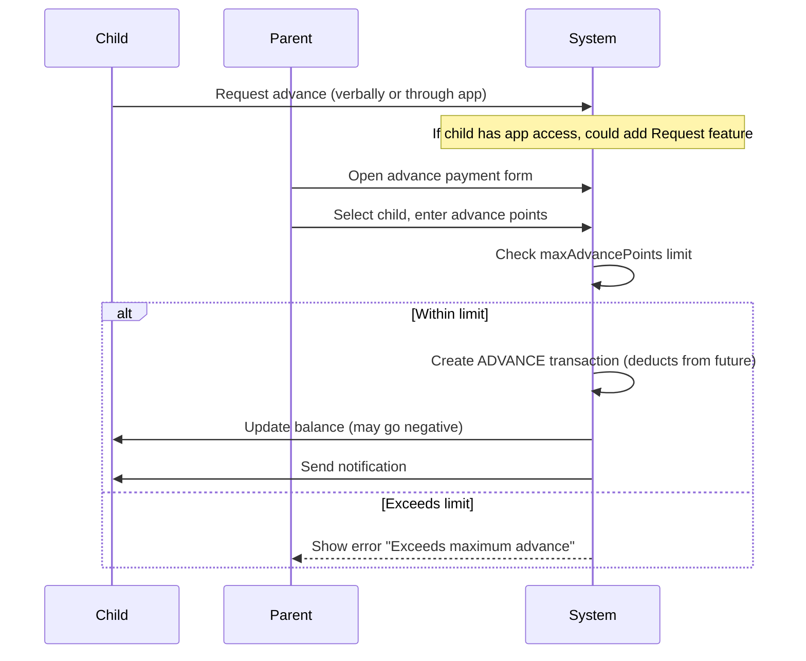

# Pocket Money System Design

This document outlines the design for a comprehensive pocket money system using points in the Chore-Ganizer application.

## Overview

The pocket money system converts earned points into monetary value, allowing parents to regulate children's pocket money through a point-based reward system. This creates a meaningful connection between chore completion and actual earnings.

---

## 1. Database Schema Changes

### 1.1 New Models

```prisma
// ============================================
// Pocket Money Configuration (Family-wide settings)
// ============================================

model PocketMoneyConfig {
  id              Int       @id @default(autoincrement())
  
  // Point-to-currency conversion
  // Example: 10 = €0.10 per point (stored as cents to avoid floating point issues)
  pointValueInCents Int     @default(10) // 10 cents = €0.10 per point
  
  // Currency code (EUR, USD, GBP, etc.)
  currency         String   @default("EUR")
  
  // Payout period: "WEEKLY" or "MONTHLY"
  payoutPeriod     String   @default("WEEKLY")
  
  // Day of week (0-6, Sunday-Saturday) for weekly payouts
  // or day of month (1-28) for monthly payouts
  payoutDay        Int      @default(0) // 0 = Sunday for weekly, 1st of month for monthly
  
  // Payout timing: "END" (end of period) or "START" (beginning of period)
  payoutTiming     String   @default("END")
  
  // Allow negative balances (advance payments)
  allowNegativeBalance Boolean @default(false)
  
  // Maximum advance allowed (in points)
  maxAdvancePoints  Int      @default(0)
  
  // Whether the system is enabled
  isEnabled        Boolean  @default(true)
  
  // Timestamps
  createdAt        DateTime @default(now())
  updatedAt        DateTime @updatedAt
  
  // Relation to family (first parent creates it)
  createdById      Int
}

// ============================================
// Point Transaction History
// ============================================

model PointTransaction {
  id              Int       @id @default(autoincrement())
  
  // User whose points changed
  userId          Int
  user            User      @relation(fields: [userId], references: [id], onDelete: Cascade)
  
  // Type of transaction
  // "EARNED" - points earned from completing chores
  // "BONUS" - bonus points added by parent
  // "DEDUCTION" - points deducted by parent
  // "PENALTY" - points deducted as overdue penalty
  // "PAYOUT" - points converted to money and paid out
  // "ADVANCE" - points advanced (deducted from future)
  // "ADJUSTMENT" - manual adjustment by parent
  type            String
  
  // Point amount (positive for earning/bonus, negative for deduction/penalty/payout/advance)
  points          Int
  
  // Running balance after this transaction
  balanceAfter    Int
  
  // Reference to source (optional)
  // For EARNED: choreAssignmentId or choreOccurrenceId
  // For PAYOUT: payoutId
  choreAssignmentId Int?
  choreOccurrenceId  Int?
  payoutId         Int?
  
  // Optional reason/description
  reason          String?
  
  // Parent who approved/made the transaction (for manual transactions)
  approvedById    Int?
  
  // Timestamps
  createdAt       DateTime  @default(now())
  
  @@index([userId])
  @@index([type])
  @@index([createdAt])
}

// ============================================
// Payout Records
// ============================================

model Payout {
  id              Int       @id @default(autoincrement())
  
  // Child who received the payout
  userId          Int
  user            User      @relation(fields: [userId], references: [id], onDelete: Cascade)
  
  // Payout period covered
  periodStart     DateTime
  periodEnd       DateTime
  
  // Points included in this payout
  pointsConverted Int
  
  // Monetary value (in cents)
  amountInCents   Int
  
  // Status: "PENDING", "PAID", "CANCELLED"
  status          String    @default("PENDING")
  
  // When the payout was marked as paid
  paidAt          DateTime?
  
  // Parent who processed the payout
  processedById   Int?
  
  // Optional notes
  notes           String?
  
  // Timestamps
  createdAt       DateTime  @default(now())
  updatedAt       DateTime  @updatedAt
  
  @@index([userId])
  @@index([status])
  @@index([periodStart])
}
```

### 1.2 Changes to Existing Models

**User Model Additions:**
```prisma
model User {
  // ... existing fields ...
  
  // New relations
  pointTransactions PointTransaction[]
  payouts           Payout[]
  
  // Virtual field (computed, not stored):
  // pendingPayoutPoints - points available for payout this period
  // currentBalance - current point balance
}
```

**ChoreAssignment - Add reference to PointTransaction:**
```prisma
model ChoreAssignment {
  // ... existing fields ...
  
  // Add reference to track when points were awarded
  pointTransactionId Int?
}
```

---

## 2. API Endpoints

### 2.1 Configuration Endpoints (Parent Only)

| Method | Endpoint | Description |
|--------|----------|-------------|
| GET | `/api/pocket-money/config` | Get current pocket money configuration |
| PUT | `/api/pocket-money/config` | Update pocket money configuration |
| GET | `/api/pocket-money/config/children` | Get children point summaries for parent |

### 2.2 Point Balance & History Endpoints

| Method | Endpoint | Description |
|--------|----------|-------------|
| GET | `/api/pocket-money/balance` | Get current user's point balance and projected earnings |
| GET | `/api/pocket-money/transactions` | Get point transaction history |
| GET | `/api/pocket-money/transactions/:userId` | (Parent) Get child's transaction history |

### 2.3 Payout Management Endpoints (Parent Only)

| Method | Endpoint | Description |
|--------|----------|-------------|
| GET | `/api/pocket-money/payouts` | Get all payouts (with filters) |
| GET | `/api/pocket-money/payouts/pending` | Get pending payouts ready for processing |
| POST | `/api/pocket-money/payouts` | Create a new payout record |
| PUT | `/api/pocket-money/payouts/:id/pay` | Mark payout as paid |
| PUT | `/api/pocket-money/payouts/:id/cancel` | Cancel a pending payout |

### 2.4 Bonus/Deduction Endpoints (Parent Only)

| Method | Endpoint | Description |
|--------|----------|-------------|
| POST | `/api/pocket-money/bonus` | Add bonus points to a child |
| POST | `/api/pocket-money/deduction` | Deduct points from a child |
| POST | `/api/pocket-money/adjustment` | Manual adjustment (with reason) |

### 2.5 Advance Payment Endpoints

| Method | Endpoint | Description |
|--------|----------|-------------|
| POST | `/api/pocket-money/advance` | (Parent) Grant advance payment to child |
| GET | `/api/pocket-money/advances` | Get advance history |

---

## 3. Frontend Components

### 3.1 Child View Components

**PocketMoneyCard** - Main dashboard component showing:
- Current point balance (large, prominent display)
- Projected earnings (points × conversion rate)
- Progress bar toward next payout
- Quick stats: earned this week/month

**PointHistoryList** - Transaction history showing:
- List of point transactions with icons
- Type indicator (earned, bonus, deduction, payout)
- Running balance
- Source reference (chore name, parent name, etc.)
- Date/time

**ProjectedEarnings** - Breakdown showing:
- Pending points (earned but not yet paid out)
- Estimated monetary value
- Next payout date

### 3.2 Parent View Components

**PocketMoneyDashboard** - Overview of all children:
- Cards for each child showing:
  - Current balance
  - Pending points for payout
  - Projected payout amount
  - Quick action buttons

**PayoutManagementPanel** - Payout processing:
- List of children with pending points
- One-click "Pay All" button
- Individual payout buttons
- Advance payment controls

**ConfigurationForm** - Settings management:
- Point value input (with live preview)
- Currency selector
- Payout period toggle (weekly/monthly)
- Payout day selector
- Advance payment settings
- Enable/disable toggle

**BonusDeductionModal** - For adding/removing points:
- Child selector
- Point amount input (+/-)
- Reason/description field
- Confirmation with balance preview

### 3.3 Navigation Integration

Add new navigation items:
- **Child View**: "My Points" or "My Earnings" in main nav
- **Parent View**: "Pocket Money" section in settings or dashboard

---

## 4. Configuration Options

### 4.1 Point Value Configuration

| Setting | Type | Default | Description |
|---------|------|---------|-------------|
| `pointValueInCents` | Integer | 10 | Value of 1 point in cents (10 = €0.10) |
| `currency` | String | EUR | Currency code (EUR, USD, GBP, etc.) |

### 4.2 Payout Period Configuration

| Setting | Type | Default | Description |
|---------|------|---------|-------------|
| `payoutPeriod` | Enum | WEEKLY | "WEEKLY" or "MONTHLY" |
| `payoutDay` | Integer | 0 | Day of week (0-6) or month (1-28) |
| `payoutTiming` | Enum | END | "END" (end of period) or "START" (beginning) |

### 4.3 Advance Payment Configuration

| Setting | Type | Default | Description |
|---------|------|---------|-------------|
| `allowNegativeBalance` | Boolean | false | Allow children to go negative |
| `maxAdvancePoints` | Integer | 0 | Maximum advance in points (0 = disabled) |

---

## 5. User Flow Examples

### 5.1 Weekly Payout Process



### 5.2 Bonus/Deduction Workflow



### 5.3 Advance Payment Request



---

## 6. Edge Cases & Considerations

### 6.1 Negative Balance

- **Scenario**: Child receives advance payment or large deduction
- **Handling**: 
  - If `allowNegativeBalance` is false, block transactions that would cause negative balance
  - If true, allow but show warning
  - Child cannot earn more points until balance is positive (optional rule)

### 6.2 Missed Payouts

- **Scenario**: Parent doesn't process payout on time
- **Handling**:
  - Points accumulate indefinitely until paid
  - System shows "overdue" payout indicator
  - Optional: Auto-payout at end of grace period

### 6.3 Chore Deletion After Points Earned

- **Scenario**: Parent deletes a chore template after child earned points
- **Handling**:
  - PointTransaction already created, so balance is preserved
  - Transaction shows "Deleted chore" as reference

### 6.4 Multiple Currency Support

- **Implementation**:
  - Store currency code in config
  - Frontend uses Intl.NumberFormat for display
  - API returns amount in smallest currency unit (cents)

### 6.5 Payout Period Changes

- **Scenario**: Parent changes from weekly to monthly mid-period
- **Handling**:
  - Existing pending points carry over to new period
  - System recalculates based on new period boundaries

---

## 7. Implementation Phases

### Phase 1: Core Functionality
1. Add database models
2. Create configuration API
3. Implement point transaction tracking
4. Build basic payout functionality

### Phase 2: Frontend
1. Child view: Balance and history
2. Parent view: Dashboard and management
3. Configuration form

### Phase 3: Advanced Features
1. Advance payment system
2. Automated payout reminders
3. Export/payment integration

---

## 8. Data Migration Notes

### Migrating Existing Points

On first deployment, existing user points need to be preserved:

```sql
-- Create initial transactions for existing points
-- This is a one-time migration script
INSERT INTO PointTransaction (userId, type, points, balanceAfter, reason, createdAt)
SELECT 
    id,
    'ADJUSTMENT',
    points,
    points,
    'Initial balance migration',
    createdAt
FROM User
WHERE points > 0;
```

---

## 9. Security Considerations

1. **Parent-only endpoints**: All configuration and manual transaction endpoints require PARENT role
2. **Audit trail**: All point changes create PointTransaction records for accountability
3. **Rate limiting**: Protect payout endpoints from abuse
4. **Input validation**: Validate point amounts, prevent extreme values

---

## 10. Example Calculations

### Example 1: Weekly Payout
- Point value: €0.10 per point (10 cents)
- Child earns 50 points in a week
- Payout: 50 × €0.10 = €5.00

### Example 2: With Bonus and Deduction
- Starting balance: 100 points
- Earns from chores: +30 points
- Bonus for good behavior: +10 points
- Deduction for broken item: -5 points
- Ending balance: 135 points
- Potential payout: 135 × €0.10 = €13.50

### Example 3: Advance Payment
- Current balance: 20 points
- Advance requested: 30 points
- New balance: -10 points (if allowed)
- Future earnings will first offset the negative balance

---

*Document Version: 1.0*
*Created: 2026-02-17*
