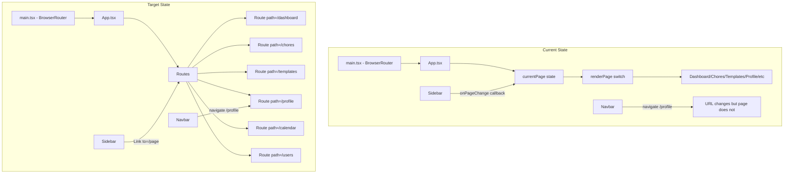

# React Router Conversion Plan

## Problem Statement

The application has a navigation inconsistency:
- [`Navbar.tsx`](dev/chore-ganizer/frontend/src/components/layout/Navbar.tsx:24) uses React Router's `navigate('/profile')` 
- [`App.tsx`](dev/chore-ganizer/frontend/src/App.tsx:28) uses state-based navigation with `currentPage` and a `renderPage()` switch statement
- [`Sidebar.tsx`](dev/chore-ganizer/frontend/src/components/layout/Sidebar.tsx:32) uses callback-based `onPageChange()`

This causes the profile navigation to fail because `navigate()` changes the URL but doesn't update the `currentPage` state.

## Solution: Convert to React Router

Convert the entire application to use React Router v6 properly with `<Routes>` and `<Route>` components.

## Architecture Diagram



## Files to Modify

### 1. [`App.tsx`](dev/chore-ganizer/frontend/src/App.tsx)

**Changes:**
- Remove `currentPage` state and `setCurrentPage`
- Remove `renderPage()` switch function
- Add `<Routes>` component with individual `<Route>` entries
- Add a layout wrapper route or keep Navbar/Sidebar outside Routes
- Handle protected routes for parents-only pages (templates, calendar)

**Route Structure:**
| Path | Component | Access |
|------|-----------|--------|
| `/` | `<Navigate to="/dashboard" replace />` | All authenticated |
| `/dashboard` | Dashboard | All authenticated |
| `/chores` | Chores | All authenticated |
| `/templates` | Templates | Parents only |
| `/profile` | Profile | All authenticated |
| `/calendar` | Calendar | Parents only |
| `/users` | Users | All authenticated |
| `*` | NotFound | All |

**App.tsx Routes Implementation:**
```tsx
import { Routes, Route, Navigate } from 'react-router-dom'

// Inside AppContent return:
<Routes>
  <Route path="/" element={<Navigate to="/dashboard" replace />} />
  <Route path="/dashboard" element={<Dashboard />} />
  <Route path="/chores" element={<Chores />} />
  <Route path="/profile" element={<Profile />} />
  <Route path="/users" element={<Users />} />
  <Route 
    path="/templates" 
    element={
      <ProtectedRoute isParentOnly>
        <Templates />
      </ProtectedRoute>
    } 
  />
  <Route 
    path="/calendar" 
    element={
      <ProtectedRoute isParentOnly>
        <Calendar />
      </ProtectedRoute>
    } 
  />
  <Route path="*" element={<NotFound />} />
</Routes>
```

### 2. [`Sidebar.tsx`](dev/chore-ganizer/frontend/src/components/layout/Sidebar.tsx)

**Changes:**
- Remove `currentPage` and `onPageChange` props
- Use `useLocation()` hook to determine active page
- Replace `onClick` with React Router `<Link>` components
- Update styling to use location-based active state

**Before:**
```tsx
interface SidebarProps {
  currentPage: string
  onPageChange: (page: string) => void
}
// ...
onClick={() => onPageChange(item.id)}
```

**After:**
```tsx
import { Link, useLocation } from 'react-router-dom'

export const Sidebar: React.FC = () => {
  const location = useLocation()
  // ...
  <Link to={`/${item.id}`}>
    {/* active based on location.pathname */}
  </Link>
}
```

### 3. [`Navbar.tsx`](dev/chore-ganizer/frontend/src/components/layout/Navbar.tsx)

**No changes needed** - The `navigate('/profile')` call will work correctly once routes are defined.

## Implementation Steps

1. **Update App.tsx**
   - Import `Routes`, `Route`, `Navigate` from react-router-dom
   - Create route definitions for all pages
   - Add protected route wrapper for parent-only routes
   - Keep Navbar and Sidebar outside Routes for persistent layout

2. **Update Sidebar.tsx**
   - Remove props interface
   - Add `useLocation` hook
   - Replace buttons with `<Link>` components
   - Update active state logic

3. **Test Navigation**
   - Verify all sidebar links work
   - Verify profile navigation from Navbar works
   - Verify parent-only route protection
   - Verify direct URL access works

4. **Rebuild Docker Container**
   - Rebuild frontend container
   - Test in browser

## Protected Routes Consideration

For parent-only routes (templates, calendar), we need a wrapper component:

```tsx
const ProtectedRoute: React.FC<{ children: React.ReactNode; isParentOnly?: boolean }> = ({ 
  children, 
  isParentOnly 
}) => {
  const { isParent } = useAuth()
  
  if (isParentOnly && !isParent) {
    return <Navigate to="/dashboard" replace />
  }
  
  return <>{children}</>
}
```

## Benefits of This Approach

1. **URL-based navigation** - Users can bookmark specific pages
2. **Browser history** - Back/forward buttons work correctly
3. **Consistency** - All navigation uses the same mechanism
4. **Deep linking** - Direct access to any page via URL
5. **Better UX** - Expected web app behavior
