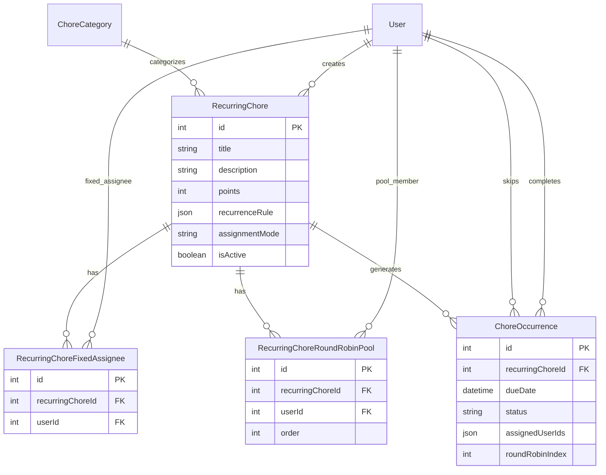
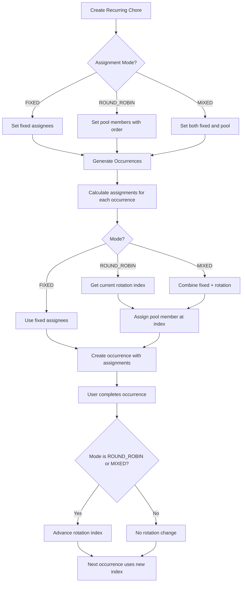
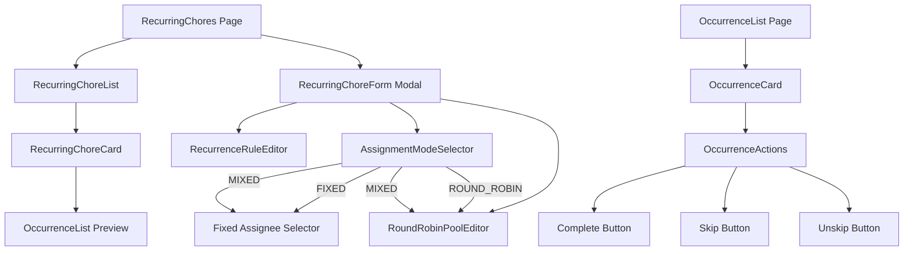
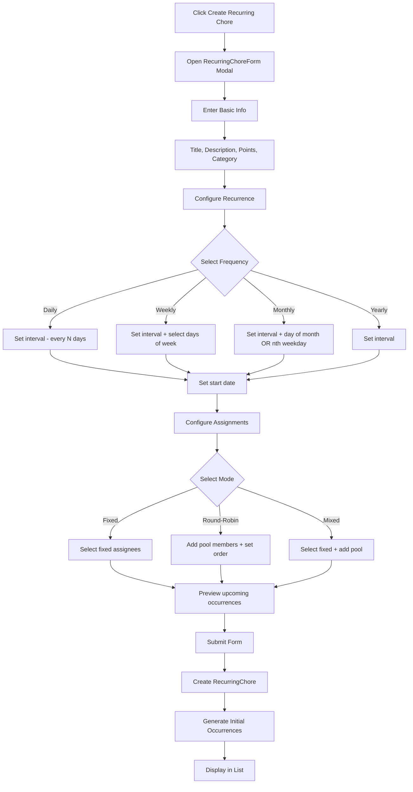

# Recurring Chore System Architecture Plan

## Overview

This document outlines the architectural design for implementing a recurring chore system in the chore-ganizer family chore management application. The system supports flexible recurrence patterns, mixed assignment modes (fixed and round-robin), and a 30-day occurrence generation window.

---

## 1. Database Schema Design

### 1.1 New Tables

#### `RecurringChore` Table

Stores the definition of a recurring chore, including its recurrence pattern and assignment configuration.

```prisma
model RecurringChore {
  id              Int                 @id @default(autoincrement())
  title           String
  description     String?
  points          Int
  icon            String?
  color           String?
  categoryId      Int?
  category        ChoreCategory?      @relation(fields: [categoryId], references: [id], onDelete: SetNull)
  createdById     Int
  createdBy       User                @relation("CreatedRecurringChores", fields: [createdById], references: [id], onDelete: Cascade)
  
  // Recurrence pattern stored as JSON
  recurrenceRule  Json                // Stores RecurrenceRule object
  
  // Assignment configuration
  assignmentMode  String              // "FIXED", "ROUND_ROBIN", "MIXED"
  
  // Track if recurring chore is active (can be deactivated to stop future occurrences)
  isActive        Boolean             @default(true)
  
  // Timestamps
  createdAt       DateTime            @default(now())
  updatedAt       DateTime            @updatedAt
  
  // Relations
  fixedAssignees  RecurringChoreFixedAssignee[]
  roundRobinPool  RecurringChoreRoundRobinPool[]
  occurrences     ChoreOccurrence[]
  
  @@index([createdById])
  @@index([categoryId])
  @@index([isActive])
}
```

#### `RecurringChoreFixedAssignee` Table

Junction table for fixed assignees (children who are always assigned to this chore).

```prisma
model RecurringChoreFixedAssignee {
  id              Int           @id @default(autoincrement())
  recurringChoreId Int
  recurringChore  RecurringChore @relation(fields: [recurringChoreId], references: [id], onDelete: Cascade)
  userId          Int
  user            User          @relation(fields: [userId], references: [id], onDelete: Cascade)
  
  @@unique([recurringChoreId, userId])
  @@index([recurringChoreId])
  @@index([userId])
}
```

#### `RecurringChoreRoundRobinPool` Table

Junction table for round-robin pool members with rotation order.

```prisma
model RecurringChoreRoundRobinPool {
  id              Int           @id @default(autoincrement())
  recurringChoreId Int
  recurringChore  RecurringChore @relation(fields: [recurringChoreId], references: [id], onDelete: Cascade)
  userId          Int
  user            User          @relation(fields: [userId], references: [id], onDelete: Cascade)
  order           Int           // Order in the rotation (0-indexed)
  
  @@unique([recurringChoreId, userId])
  @@index([recurringChoreId])
  @@index([userId])
}
```

#### `ChoreOccurrence` Table

Stores individual occurrences of recurring chores within the 30-day window.

```prisma
model ChoreOccurrence {
  id              Int           @id @default(autoincrement())
  recurringChoreId Int
  recurringChore  RecurringChore @relation(fields: [recurringChoreId], references: [id], onDelete: Cascade)
  
  // The specific date this occurrence is due
  dueDate         DateTime
  
  // Current status
  status          String        @default("PENDING") // "PENDING", "COMPLETED", "SKIPPED"
  
  // Assignment snapshot at generation time
  // For FIXED: same as recurring chore fixed assignees
  // For ROUND_ROBIN: current person in rotation
  // For MIXED: both fixed and current round-robin person
  assignedUserIds Json          // Array of user IDs assigned to this occurrence
  
  // Round-robin state tracking
  roundRobinIndex Int?          // Current index in rotation (for tracking)
  
  // Completion tracking
  completedAt     DateTime?
  completedById   Int?          // User who marked as complete (could be parent or the child)
  completedBy     User?         @relation("CompletedOccurrences", fields: [completedById], references: [id], onDelete: SetNull)
  
  // Skip tracking
  skippedAt       DateTime?
  skippedById     Int?
  skippedBy       User?         @relation("SkippedOccurrences", fields: [skippedById], references: [id], onDelete: SetNull)
  skipReason      String?
  
  // Points awarded (snapshot from recurring chore at completion time)
  pointsAwarded   Int?
  
  // Notes for this specific occurrence
  notes           String?
  
  createdAt       DateTime      @default(now())
  updatedAt       DateTime      @updatedAt
  
  @@unique([recurringChoreId, dueDate]) // One occurrence per recurring chore per date
  @@index([recurringChoreId])
  @@index([dueDate])
  @@index([status])
  @@index([assignedUserIds]) // May need to use a different approach for JSON indexing
}
```

### 1.2 Recurrence Rule JSON Structure

The `recurrenceRule` field stores a JSON object defining the recurrence pattern:

```typescript
interface RecurrenceRule {
  // Base frequency
  frequency: 'DAILY' | 'WEEKLY' | 'MONTHLY' | 'YEARLY'
  
  // "Every N" modifier (e.g., every 2 weeks)
  interval: number // Default: 1
  
  // Start date for the recurrence (first occurrence)
  startDate: string // ISO date string
  
  // Day-specific patterns
  byDayOfWeek?: number[] // 0=Sunday, 1=Monday, etc. For "Mon/Wed/Fri" patterns
  byDayOfMonth?: number // 1-31, for "15th of every month"
  byNthWeekday?: {
    weekday: number // 0-6 (Sunday-Saturday)
    nth: number // 1-5 (first, second, third, fourth, last)
  } // For "2nd Tuesday of every month"
  
  // For monthly patterns with day-of-week
  monthlyPattern?: 'BY_DAY_OF_MONTH' | 'BY_NTH_WEEKDAY'
}
```

**Examples:**

```json
// Every day
{
  "frequency": "DAILY",
  "interval": 1,
  "startDate": "2026-02-16"
}

// Every 3 days
{
  "frequency": "DAILY",
  "interval": 3,
  "startDate": "2026-02-16"
}

// Every week on Monday, Wednesday, Friday
{
  "frequency": "WEEKLY",
  "interval": 1,
  "startDate": "2026-02-16",
  "byDayOfWeek": [1, 3, 5]
}

// Every 2 weeks (no specific days = same day as start)
{
  "frequency": "WEEKLY",
  "interval": 2,
  "startDate": "2026-02-16"
}

// 15th of every month
{
  "frequency": "MONTHLY",
  "interval": 1,
  "startDate": "2026-02-15",
  "byDayOfMonth": 15
}

// 2nd Tuesday of every month
{
  "frequency": "MONTHLY",
  "interval": 1,
  "startDate": "2026-02-09",
  "byNthWeekday": {
    "weekday": 2,
    "nth": 2
  }
}

// Every year on a specific date
{
  "frequency": "YEARLY",
  "interval": 1,
  "startDate": "2026-02-16"
}
```

### 1.3 Modifications to Existing Tables

#### Update `User` Model

Add relations for recurring chores:

```prisma
model User {
  // ... existing fields ...
  
  // New relations
  createdRecurringChores  RecurringChore[]           @relation("CreatedRecurringChores")
  fixedRecurringChores    RecurringChoreFixedAssignee[]
  roundRobinChores        RecurringChoreRoundRobinPool[]
  completedOccurrences    ChoreOccurrence[]          @relation("CompletedOccurrences")
  skippedOccurrences      ChoreOccurrence[]          @relation("SkippedOccurrences")
}
```

### 1.4 Entity Relationship Diagram



---

## 2. Recurrence Engine Design

### 2.1 Occurrence Generation Algorithm

The recurrence engine generates occurrences for the next 30 days from the current date.

```typescript
class RecurrenceEngine {
  /**
   * Generate occurrences for a recurring chore within a date range
   */
  generateOccurrences(
    rule: RecurrenceRule,
    startDate: Date,
    endDate: Date
  ): Date[] {
    const occurrences: Date[] = []
    let currentDate = new Date(rule.startDate)
    
    switch (rule.frequency) {
      case 'DAILY':
        return this.generateDailyOccurrences(rule, startDate, endDate)
      case 'WEEKLY':
        return this.generateWeeklyOccurrences(rule, startDate, endDate)
      case 'MONTHLY':
        return this.generateMonthlyOccurrences(rule, startDate, endDate)
      case 'YEARLY':
        return this.generateYearlyOccurrences(rule, startDate, endDate)
    }
  }
  
  private generateDailyOccurrences(
    rule: RecurrenceRule,
    startDate: Date,
    endDate: Date
  ): Date[] {
    const occurrences: Date[] = []
    let currentDate = new Date(rule.startDate)
    
    // Advance to start of window if needed
    while (currentDate < startDate) {
      currentDate.setDate(currentDate.getDate() + rule.interval)
    }
    
    // Generate occurrences within window
    while (currentDate <= endDate) {
      occurrences.push(new Date(currentDate))
      currentDate.setDate(currentDate.getDate() + rule.interval)
    }
    
    return occurrences
  }
  
  private generateWeeklyOccurrences(
    rule: RecurrenceRule,
    startDate: Date,
    endDate: Date
  ): Date[] {
    const occurrences: Date[] = []
    
    if (rule.byDayOfWeek && rule.byDayOfWeek.length > 0) {
      // Specific days of week pattern (e.g., Mon/Wed/Fri)
      let currentWeekStart = this.getStartOfWeek(startDate)
      
      while (currentWeekStart <= endDate) {
        for (const dayOfWeek of rule.byDayOfWeek.sort()) {
          const occurrence = new Date(currentWeekStart)
          occurrence.setDate(occurrence.getDate() + dayOfWeek)
          
          // Apply interval (every N weeks)
          const weeksSinceStart = Math.floor(
            (occurrence.getTime() - new Date(rule.startDate).getTime()) 
            / (7 * 24 * 60 * 60 * 1000)
          )
          
          if (weeksSinceStart % rule.interval === 0 &&
              occurrence >= startDate && 
              occurrence <= endDate &&
              occurrence >= new Date(rule.startDate)) {
            occurrences.push(occurrence)
          }
        }
        currentWeekStart.setDate(currentWeekStart.getDate() + 7 * rule.interval)
      }
    } else {
      // Same day of week as start date, every N weeks
      const startDayOfWeek = new Date(rule.startDate).getDay()
      let currentDate = new Date(rule.startDate)
      
      while (currentDate < startDate) {
        currentDate.setDate(currentDate.getDate() + 7 * rule.interval)
      }
      
      while (currentDate <= endDate) {
        if (currentDate.getDay() === startDayOfWeek) {
          occurrences.push(new Date(currentDate))
        }
        currentDate.setDate(currentDate.getDate() + 7 * rule.interval)
      }
    }
    
    return occurrences.sort((a, b) => a.getTime() - b.getTime())
  }
  
  private generateMonthlyOccurrences(
    rule: RecurrenceRule,
    startDate: Date,
    endDate: Date
  ): Date[] {
    const occurrences: Date[] = []
    
    if (rule.byDayOfMonth) {
      // Nth day of month (e.g., 15th of every month)
      let currentMonth = new Date(startDate)
      currentMonth.setDate(1) // Start from beginning of month
      
      while (currentMonth <= endDate) {
        const occurrence = new Date(currentMonth)
        occurrence.setDate(rule.byDayOfMonth)
        
        // Check if this month is within interval
        const monthsSinceStart = this.getMonthsDifference(
          new Date(rule.startDate),
          occurrence
        )
        
        if (monthsSinceStart % rule.interval === 0 &&
            occurrence >= startDate &&
            occurrence <= endDate &&
            occurrence >= new Date(rule.startDate)) {
          // Handle months with fewer days
          if (occurrence.getDate() === rule.byDayOfMonth) {
            occurrences.push(occurrence)
          }
        }
        
        currentMonth.setMonth(currentMonth.getMonth() + 1)
      }
    } else if (rule.byNthWeekday) {
      // Nth weekday of month (e.g., 2nd Tuesday)
      let currentMonth = new Date(startDate)
      currentMonth.setDate(1)
      
      while (currentMonth <= endDate) {
        const occurrence = this.getNthWeekdayOfMonth(
          currentMonth,
          rule.byNthWeekday.weekday,
          rule.byNthWeekday.nth
        )
        
        const monthsSinceStart = this.getMonthsDifference(
          new Date(rule.startDate),
          occurrence
        )
        
        if (monthsSinceStart % rule.interval === 0 &&
            occurrence >= startDate &&
            occurrence <= endDate &&
            occurrence >= new Date(rule.startDate)) {
          occurrences.push(occurrence)
        }
        
        currentMonth.setMonth(currentMonth.getMonth() + 1)
      }
    }
    
    return occurrences
  }
  
  private getNthWeekdayOfMonth(
    date: Date,
    weekday: number,
    nth: number
  ): Date {
    const result = new Date(date.getFullYear(), date.getMonth(), 1)
    
    // Find first occurrence of the weekday
    while (result.getDay() !== weekday) {
      result.setDate(result.getDate() + 1)
    }
    
    // Advance to nth occurrence
    if (nth > 0) {
      result.setDate(result.getDate() + (nth - 1) * 7)
    } else {
      // Handle "last" (-1 or 5 meaning last)
      // Find last occurrence
      const lastDay = new Date(date.getFullYear(), date.getMonth() + 1, 0)
      while (result.getDay() !== weekday) {
        result.setDate(result.getDate() - 1)
      }
    }
    
    return result
  }
}
```

### 2.2 30-Day Generation Window Strategy

The system uses a **lazy generation** approach with a scheduled job:

```typescript
interface OccurrenceGenerationStrategy {
  // Generate occurrences on-demand when fetching
  onDemandGeneration: boolean
  
  // Background job to pre-generate occurrences
  scheduledGeneration: boolean
  
  // How far ahead to generate
  generationWindowDays: number
}
```

**Implementation Approach:**

1. **On-Demand Generation**: When fetching occurrences, check if any are missing and generate them
2. **Scheduled Job**: Run daily to generate new occurrences as the window moves forward
3. **Window Calculation**: `windowStart = today`, `windowEnd = today + 30 days`

```typescript
class OccurrenceGenerationService {
  /**
   * Ensure occurrences exist for the next 30 days
   */
  async ensureOccurrencesGenerated(recurringChoreId: number): Promise<void> {
    const recurringChore = await this.getRecurringChore(recurringChoreId)
    if (!recurringChore.isActive) return
    
    const today = new Date()
    today.setHours(0, 0, 0, 0)
    
    const windowEnd = new Date(today)
    windowEnd.setDate(windowEnd.getDate() + 30)
    
    // Get existing occurrences in window
    const existingOccurrences = await this.getOccurrencesInRange(
      recurringChoreId,
      today,
      windowEnd
    )
    
    // Generate all potential dates
    const potentialDates = this.recurrenceEngine.generateOccurrences(
      recurringChore.recurrenceRule,
      today,
      windowEnd
    )
    
    // Find missing dates
    const existingDates = new Set(
      existingOccurrences.map(o => o.dueDate.toDateString())
    )
    
    const missingDates = potentialDates.filter(
      d => !existingDates.has(d.toDateString())
    )
    
    // Create missing occurrences
    for (const date of missingDates) {
      await this.createOccurrence(recurringChore, date)
    }
  }
  
  /**
   * Create a single occurrence with proper assignments
   */
  private async createOccurrence(
    recurringChore: RecurringChore,
    dueDate: Date
  ): Promise<ChoreOccurrence> {
    const assignedUserIds = await this.calculateAssignments(recurringChore, dueDate)
    
    return await prisma.choreOccurrence.create({
      data: {
        recurringChoreId: recurringChore.id,
        dueDate,
        status: 'PENDING',
        assignedUserIds: JSON.stringify(assignedUserIds),
        roundRobinIndex: await this.getCurrentRoundRobinIndex(recurringChore)
      }
    })
  }
}
```

---

## 3. Round-Robin Assignment Logic

### 3.1 Rotation State Tracking

The round-robin state is tracked using:

1. **`RecurringChoreRoundRobinPool.order`**: Defines the rotation order of pool members
2. **`ChoreOccurrence.roundRobinIndex`**: Records which index was used for that occurrence
3. **Completion-based rotation**: Index advances only when a chore is COMPLETED

```typescript
interface RoundRobinState {
  // Pool members in order
  pool: Array<{ userId: number; order: number }>
  
  // Current index in rotation
  currentIndex: number
  
  // Last completed occurrence (to determine next rotation)
  lastCompletedOccurrenceId: number | null
}
```

### 3.2 Assignment Calculation

```typescript
class AssignmentService {
  /**
   * Calculate assigned users for an occurrence
   */
  async calculateAssignments(
    recurringChore: RecurringChore,
    dueDate: Date
  ): Promise<number[]> {
    const assignedUserIds: number[] = []
    
    // Add fixed assignees
    const fixedAssignees = await this.getFixedAssignees(recurringChore.id)
    assignedUserIds.push(...fixedAssignees.map(a => a.userId))
    
    // Add round-robin assignee if applicable
    if (recurringChore.assignmentMode === 'ROUND_ROBIN' || 
        recurringChore.assignmentMode === 'MIXED') {
      const roundRobinUserId = await this.getCurrentRoundRobinUser(recurringChore)
      if (roundRobinUserId) {
        assignedUserIds.push(roundRobinUserId)
      }
    }
    
    return assignedUserIds
  }
  
  /**
   * Get the current user in the round-robin rotation
   */
  async getCurrentRoundRobinUser(
    recurringChore: RecurringChore
  ): Promise<number | null> {
    const pool = await this.getRoundRobinPool(recurringChore.id)
    if (pool.length === 0) return null
    
    const currentIndex = await this.getCurrentRoundRobinIndex(recurringChore)
    return pool[currentIndex].userId
  }
  
  /**
   * Get current rotation index based on last COMPLETED occurrence
   */
  async getCurrentRoundRobinIndex(
    recurringChore: RecurringChore
  ): Promise<number> {
    const pool = await this.getRoundRobinPool(recurringChore.id)
    if (pool.length === 0) return 0
    
    // Find the most recent COMPLETED occurrence
    const lastCompleted = await prisma.choreOccurrence.findFirst({
      where: {
        recurringChoreId: recurringChore.id,
        status: 'COMPLETED'
      },
      orderBy: { dueDate: 'desc' }
    })
    
    if (!lastCompleted || lastCompleted.roundRobinIndex === null) {
      return 0 // Start at beginning
    }
    
    // Next index (wrap around)
    return (lastCompleted.roundRobinIndex + 1) % pool.length
  }
  
  /**
   * Handle completion - advance round-robin if applicable
   */
  async handleCompletion(
    occurrence: ChoreOccurrence
  ): Promise<void> {
    const recurringChore = await this.getRecurringChore(occurrence.recurringChoreId)
    
    if (recurringChore.assignmentMode === 'ROUND_ROBIN' ||
        recurringChore.assignmentMode === 'MIXED') {
      
      const pool = await this.getRoundRobinPool(recurringChore.id)
      const currentIndex = occurrence.roundRobinIndex ?? 0
      
      // The next occurrence will use the next index
      // This is automatically calculated when generating new occurrences
      // based on the last completed occurrence
    }
  }
}
```

### 3.3 Mixed Mode Behavior

When `assignmentMode` is `MIXED`:

1. **Fixed assignees** are always included in every occurrence
2. **Round-robin pool** rotates one member per COMPLETED occurrence
3. **Result**: Each occurrence has `fixed assignees + current round-robin user`

**Example:**

```
Recurring Chore: "Kitchen Cleanup"
- Fixed Assignees: [Alice] (always helps)
- Round-Robin Pool: [Bob, Charlie, David] (rotate main responsibility)

Occurrences:
- Jan 1: Alice + Bob (Bob's turn)
- Jan 8: Alice + Bob (Bob still - Jan 1 not completed)
- Jan 8 (after completing Jan 1): Next occurrence will be Alice + Charlie
- Jan 15: Alice + Charlie (Charlie's turn after Bob completed)
```

### 3.4 Round-Robin Flow Diagram



---

## 4. API Endpoints Design

### 4.1 Recurring Chore CRUD Endpoints

#### `POST /api/recurring-chores`

Create a new recurring chore.

**Request Body:**
```json
{
  "title": "Kitchen Cleanup",
  "description": "Clean kitchen counters and sweep floor",
  "points": 10,
  "icon": "kitchen",
  "color": "#4CAF50",
  "categoryId": 1,
  "recurrenceRule": {
    "frequency": "WEEKLY",
    "interval": 1,
    "startDate": "2026-02-16",
    "byDayOfWeek": [1, 3, 5]
  },
  "assignmentMode": "MIXED",
  "fixedAssigneeIds": [1],
  "roundRobinPoolIds": [2, 3, 4]
}
```

**Response (201 Created):**
```json
{
  "success": true,
  "data": {
    "id": 1,
    "title": "Kitchen Cleanup",
    "recurrenceRule": { ... },
    "assignmentMode": "MIXED",
    "isActive": true,
    "createdAt": "2026-02-16T10:00:00.000Z"
  }
}
```

---

#### `GET /api/recurring-chores`

List all recurring chores (parents see all, children see only those assigned to them).

**Query Parameters:**
- `active`: Filter by active status (true/false)
- `categoryId`: Filter by category

**Response (200 OK):**
```json
{
  "success": true,
  "data": [
    {
      "id": 1,
      "title": "Kitchen Cleanup",
      "points": 10,
      "recurrenceRule": { ... },
      "assignmentMode": "MIXED",
      "isActive": true,
      "fixedAssignees": [
        { "id": 1, "name": "Alice" }
      ],
      "roundRobinPool": [
        { "id": 2, "name": "Bob", "order": 0 },
        { "id": 3, "name": "Charlie", "order": 1 },
        { "id": 4, "name": "David", "order": 2 }
      ],
      "category": {
        "id": 1,
        "name": "Cleaning"
      }
    }
  ]
}
```

---

#### `GET /api/recurring-chores/:id`

Get a single recurring chore by ID.

**Response (200 OK):**
```json
{
  "success": true,
  "data": {
    "id": 1,
    "title": "Kitchen Cleanup",
    "description": "Clean kitchen counters and sweep floor",
    "points": 10,
    "icon": "kitchen",
    "color": "#4CAF50",
    "recurrenceRule": { ... },
    "assignmentMode": "MIXED",
    "isActive": true,
    "fixedAssignees": [...],
    "roundRobinPool": [...],
    "category": {...}
  }
}
```

---

#### `PUT /api/recurring-chores/:id`

Update a recurring chore. Changes affect all FUTURE occurrences.

**Request Body:**
```json
{
  "title": "Updated Kitchen Cleanup",
  "points": 15,
  "recurrenceRule": {
    "frequency": "WEEKLY",
    "interval": 2,
    "startDate": "2026-02-16",
    "byDayOfWeek": [1, 4]
  },
  "fixedAssigneeIds": [1, 5],
  "roundRobinPoolIds": [2, 3]
}
```

**Response (200 OK):**
```json
{
  "success": true,
  "data": {
    "id": 1,
    "title": "Updated Kitchen Cleanup",
    "points": 15,
    ...
  }
}
```

**Note:** Updating a recurring chore triggers:
1. Deletion of all PENDING occurrences
2. Regeneration of occurrences with new rules
3. Completed/skipped occurrences remain unchanged

---

#### `DELETE /api/recurring-chores/:id`

Delete a recurring chore and all its occurrences.

**Response (200 OK):**
```json
{
  "success": true,
  "data": {
    "message": "Recurring chore deleted successfully"
  }
}
```

---

#### `POST /api/recurring-chores/:id/deactivate`

Deactivate a recurring chore (stop future occurrences without deleting).

**Response (200 OK):**
```json
{
  "success": true,
  "data": {
    "id": 1,
    "isActive": false
  }
}
```

---

### 4.2 Occurrence Management Endpoints

#### `GET /api/recurring-chores/occurrences`

Get all occurrences for the current 30-day window.

**Query Parameters:**
- `status`: Filter by status (PENDING, COMPLETED, SKIPPED)
- `assignedToId`: Filter by assigned user
- `dueDateFrom`: Start of date range
- `dueDateTo`: End of date range
- `recurringChoreId`: Filter by parent recurring chore

**Response (200 OK):**
```json
{
  "success": true,
  "data": [
    {
      "id": 1,
      "recurringChoreId": 1,
      "recurringChore": {
        "id": 1,
        "title": "Kitchen Cleanup",
        "points": 10,
        "icon": "kitchen",
        "color": "#4CAF50"
      },
      "dueDate": "2026-02-17T00:00:00.000Z",
      "status": "PENDING",
      "assignedUsers": [
        { "id": 1, "name": "Alice", "color": "#FF5722" },
        { "id": 2, "name": "Bob", "color": "#2196F3" }
      ],
      "completedAt": null,
      "skippedAt": null
    }
  ]
}
```

---

#### `POST /api/recurring-chores/occurrences/:id/complete`

Mark an occurrence as completed.

**Request Body:**
```json
{
  "notes": "Done ahead of schedule"
}
```

**Response (200 OK):**
```json
{
  "success": true,
  "data": {
    "id": 1,
    "status": "COMPLETED",
    "completedAt": "2026-02-16T15:30:00.000Z",
    "pointsAwarded": 10,
    "roundRobinAdvanced": true
  }
}
```

**Side Effects:**
1. Status changes to COMPLETED
2. Points awarded to assigned user(s)
3. If ROUND_ROBIN or MIXED mode, rotation advances
4. Notification sent to parent

---

#### `POST /api/recurring-chores/occurrences/:id/skip`

Skip an occurrence (does NOT advance round-robin).

**Request Body:**
```json
{
  "reason": "On vacation"
}
```

**Response (200 OK):**
```json
{
  "success": true,
  "data": {
    "id": 1,
    "status": "SKIPPED",
    "skippedAt": "2026-02-16T10:00:00.000Z",
    "skipReason": "On vacation",
    "roundRobinAdvanced": false
  }
}
```

---

#### `POST /api/recurring-chores/occurrences/:id/unskip`

Unskip a previously skipped occurrence.

**Response (200 OK):**
```json
{
  "success": true,
  "data": {
    "id": 1,
    "status": "PENDING",
    "skippedAt": null,
    "skipReason": null
  }
}
```

---

### 4.3 API Endpoint Summary Table

| Method | Endpoint | Description | Parent Only |
|--------|----------|-------------|-------------|
| POST | `/api/recurring-chores` | Create recurring chore | Yes |
| GET | `/api/recurring-chores` | List recurring chores | No |
| GET | `/api/recurring-chores/:id` | Get single recurring chore | No |
| PUT | `/api/recurring-chores/:id` | Update recurring chore | Yes |
| DELETE | `/api/recurring-chores/:id` | Delete recurring chore | Yes |
| POST | `/api/recurring-chores/:id/deactivate` | Deactivate recurring chore | Yes |
| GET | `/api/recurring-chores/occurrences` | List occurrences | No |
| POST | `/api/recurring-chores/occurrences/:id/complete` | Complete occurrence | No |
| POST | `/api/recurring-chores/occurrences/:id/skip` | Skip occurrence | Yes |
| POST | `/api/recurring-chores/occurrences/:id/unskip` | Unskip occurrence | Yes |

---

## 5. Frontend Component Structure

### 5.1 New Components

#### Page Components

```
frontend/src/pages/
  RecurringChores.tsx      # Main page for managing recurring chores
  RecurringChoreDetail.tsx # Detail view for a single recurring chore
```

#### Recurring Chore Components

```
frontend/src/components/recurring/
  index.ts
  RecurringChoreList.tsx       # List of recurring chores
  RecurringChoreCard.tsx       # Card for a single recurring chore
  RecurringChoreForm.tsx       # Form for creating/editing recurring chores
  RecurrenceRuleEditor.tsx     # Editor for recurrence patterns
  AssignmentModeSelector.tsx   # Fixed/Round-Robin/Mixed mode selector
  RoundRobinPoolEditor.tsx     # Editor for round-robin pool members
  OccurrenceList.tsx           # List of occurrences within 30-day window
  OccurrenceCard.tsx           # Card for a single occurrence
  OccurrenceActions.tsx        # Complete/Skip/Unskip action buttons
```

### 5.2 Component Hierarchy



### 5.3 UI Flow for Creating Recurring Chores



### 5.4 RecurrenceRuleEditor Component Design

The `RecurrenceRuleEditor` component provides a user-friendly interface for configuring recurrence patterns:

```typescript
interface RecurrenceRuleEditorProps {
  value: RecurrenceRule
  onChange: (rule: RecurrenceRule) => void
}

// Component structure:
// - Frequency dropdown: Daily | Weekly | Monthly | Yearly
// - Interval input: "Every N [frequency]"
// - Start date picker
// - Conditional fields based on frequency:
//   - Weekly: Day-of-week checkboxes (Sun, Mon, Tue, Wed, Thu, Fri, Sat)
//   - Monthly: Radio buttons for "Day X of month" or "Nth weekday of month"
//     - If "Day X": Number input (1-31)
//     - If "Nth weekday": Dropdowns for "1st/2nd/3rd/4th/last" + "Sunday-Saturday"
```

### 5.5 Occurrence Actions UI

```typescript
interface OccurrenceActionsProps {
  occurrence: ChoreOccurrence
  onComplete: () => void
  onSkip: () => void
  onUnskip: () => void
  canSkip: boolean // Parent only
}

// UI States:
// - PENDING: Show [Complete] and [Skip] buttons
// - COMPLETED: Show "Completed at X" with checkmark, no actions
// - SKIPPED: Show "Skipped: reason" with [Unskip] button
```

---

## 6. State Management Considerations

### 6.1 Occurrence Generation Interaction

The frontend should not be responsible for generating occurrences. Instead:

1. **Backend-driven generation**: Occurrences are generated by the backend when:
   - A new recurring chore is created
   - The 30-day window moves forward (scheduled job)
   - A recurring chore is updated (regenerate future occurrences)

2. **Frontend caching strategy**:
   - Fetch occurrences for the current 30-day window
   - Cache in React Query or similar
   - Invalidate cache after mutations (complete, skip, update)

### 6.2 React Query Integration

```typescript
// Query keys
const queryKeys = {
  recurringChores: ['recurring-chores'],
  recurringChore: (id: number) => ['recurring-chores', id],
  occurrences: (filters: OccurrenceFilters) => ['occurrences', filters],
}

// Custom hooks
function useRecurringChores(filters?: RecurringChoreFilters) {
  return useQuery({
    queryKey: queryKeys.recurringChores,
    queryFn: () => recurringChoresApi.getAll(filters),
  })
}

function useOccurrences(filters: OccurrenceFilters) {
  return useQuery({
    queryKey: queryKeys.occurrences(filters),
    queryFn: () => occurrencesApi.getAll(filters),
    // Refetch every 5 minutes to catch new occurrences
    refetchInterval: 5 * 60 * 1000,
  })
}

function useCompleteOccurrence() {
  const queryClient = useQueryClient()
  
  return useMutation({
    mutationFn: (id: number) => occurrencesApi.complete(id),
    onSuccess: () => {
      // Invalidate all occurrence queries
      queryClient.invalidateQueries({ queryKey: ['occurrences'] })
    },
  })
}
```

### 6.3 Optimistic Updates

For better UX, implement optimistic updates for complete/skip actions:

```typescript
function useCompleteOccurrence() {
  const queryClient = useQueryClient()
  
  return useMutation({
    mutationFn: (id: number) => occurrencesApi.complete(id),
    onMutate: async (id) => {
      // Cancel outgoing refetches
      await queryClient.cancelQueries({ queryKey: ['occurrences'] })
      
      // Snapshot previous value
      const previousOccurrences = queryClient.getQueryData(['occurrences'])
      
      // Optimistically update
      queryClient.setQueryData(['occurrences'], (old: Occurrence[]) =>
        old.map(occ => 
          occ.id === id 
            ? { ...occ, status: 'COMPLETED', completedAt: new Date().toISOString() }
            : occ
        )
      )
      
      return { previousOccurrences }
    },
    onError: (err, id, context) => {
      // Rollback on error
      queryClient.setQueryData(['occurrences'], context.previousOccurrences)
    },
  })
}
```

### 6.4 Background Occurrence Generation

A scheduled job runs daily to ensure occurrences are generated:

```typescript
// Backend scheduled job (using node-cron or similar)
import cron from 'node-cron'

// Run every day at midnight
cron.schedule('0 0 * * *', async () => {
  const activeRecurringChores = await prisma.recurringChore.findMany({
    where: { isActive: true }
  })
  
  for (const chore of activeRecurringChores) {
    await occurrenceGenerationService.ensureOccurrencesGenerated(chore.id)
  }
})
```

---

## 7. Edge Cases and Solutions

### 7.1 Child Removed from Family

**Scenario**: A child is deleted from the family while they have pending occurrences or are in a round-robin pool.

**Solution**:
1. **Database cascade**: `onDelete: Cascade` on foreign keys automatically removes the user from:
   - `RecurringChoreFixedAssignee`
   - `RecurringChoreRoundRobinPool`
   
2. **Occurrence reassignment**: When a user is deleted, trigger a reassignment of pending occurrences:

```typescript
async function handleUserDeletion(userId: number): Promise<void> {
  // Find all pending occurrences assigned to this user
  const pendingOccurrences = await prisma.choreOccurrence.findMany({
    where: {
      status: 'PENDING',
      // JSON contains check for assignedUserIds
    }
  })
  
  for (const occurrence of pendingOccurrences) {
    const recurringChore = await prisma.recurringChore.findUnique({
      where: { id: occurrence.recurringChoreId }
    })
    
    // Recalculate assignments without the deleted user
    const newAssignedUserIds = await calculateAssignments(recurringChore, occurrence.dueDate)
    
    await prisma.choreOccurrence.update({
      where: { id: occurrence.id },
      data: { assignedUserIds: JSON.stringify(newAssignedUserIds) }
    })
  }
  
  // Reorder round-robin pools after deletion
  const poolsWithDeletedUser = await prisma.recurringChoreRoundRobinPool.findMany({
    where: { userId }
  })
  
  for (const pool of poolsWithDeletedUser) {
    await reorderRoundRobinPool(pool.recurringChoreId)
  }
}
```

### 7.2 Timezone and Daylight Saving Time

**Scenario**: Due dates should be consistent regardless of timezone changes.

**Solution**:
1. **Store dates in UTC**: All dates stored as UTC midnight (00:00:00Z)
2. **Display in local timezone**: Frontend converts to local date for display
3. **Recurring rule uses date only**: The recurrence rule works with date-only values, not timestamps

```typescript
// When creating an occurrence
const dueDate = new Date('2026-02-16T00:00:00.000Z') // UTC midnight

// When displaying
const localDate = new Date(dueDate).toLocaleDateString() // User's local date
```

**DST Edge Case**: If a user creates a chore for "every day at midnight" and DST changes, the date remains the same (midnight UTC), avoiding ambiguity.

### 7.3 Very Frequent Chores (Daily)

**Scenario**: A daily chore generates 30 occurrences in the 30-day window.

**Solution**:
1. **Batch generation**: Generate all occurrences in a single database transaction
2. **Lazy loading**: Frontend paginates occurrences (e.g., 10 per page)
3. **Efficient queries**: Index on `dueDate` and `recurringChoreId` for fast retrieval

```typescript
// Batch creation
await prisma.$transaction(
  missingDates.map(date => 
    prisma.choreOccurrence.create({
      data: {
        recurringChoreId: chore.id,
        dueDate: date,
        status: 'PENDING',
        assignedUserIds: JSON.stringify(assignedUserIds)
      }
    })
  )
)
```

### 7.4 Month-Length Edge Cases

**Scenario**: "15th of every month" - what happens in February (28/29 days)?

**Solution**:
1. **Validation**: If `byDayOfMonth` is 29, 30, or 31, warn user that some months won't have occurrences
2. **Graceful handling**: Skip months where the day doesn't exist

```typescript
// In occurrence generation
if (rule.byDayOfMonth) {
  const daysInMonth = new Date(year, month + 1, 0).getDate()
  if (rule.byDayOfMonth > daysInMonth) {
    // Skip this month - day doesn't exist
    continue
  }
}
```

### 7.5 Round-Robin Pool Changes

**Scenario**: A new child is added to the round-robin pool mid-rotation.

**Solution**:
1. **Append to end**: New pool members are added at the end of the rotation
2. **Reindex**: When pool members are removed, reorder the remaining members

```typescript
async function addPoolMember(recurringChoreId: number, userId: number): Promise<void> {
  const currentPool = await prisma.recurringChoreRoundRobinPool.findMany({
    where: { recurringChoreId },
    orderBy: { order: 'asc' }
  })
  
  await prisma.recurringChoreRoundRobinPool.create({
    data: {
      recurringChoreId,
      userId,
      order: currentPool.length // Add at end
    }
  })
}
```

### 7.6 Modification Impact on Existing Occurrences

**Scenario**: User modifies a recurring chore's recurrence rule or assignments.

**Solution**:
1. **Preserve history**: Completed and skipped occurrences remain unchanged
2. **Regenerate future**: Delete all PENDING occurrences and regenerate with new rules

```typescript
async function updateRecurringChore(
  id: number, 
  updates: UpdateRecurringChoreData
): Promise<RecurringChore> {
  // Update the recurring chore
  const updated = await prisma.recurringChore.update({
    where: { id },
    data: updates
  })
  
  // Delete pending occurrences (keep completed/skipped)
  await prisma.choreOccurrence.deleteMany({
    where: {
      recurringChoreId: id,
      status: 'PENDING'
    }
  })
  
  // Regenerate occurrences with new rules
  await ensureOccurrencesGenerated(id)
  
  return updated
}
```

### 7.7 Concurrent Completion

**Scenario**: Multiple users try to complete the same occurrence simultaneously.

**Solution**:
1. **Optimistic locking**: Use version field or status check
2. **Idempotency**: Completing an already-completed occurrence returns success without side effects

```typescript
async function completeOccurrence(id: number): Promise<ChoreOccurrence> {
  const occurrence = await prisma.choreOccurrence.findUnique({ where: { id } })
  
  if (occurrence.status === 'COMPLETED') {
    // Already completed - return without changes
    return occurrence
  }
  
  if (occurrence.status !== 'PENDING') {
    throw new Error('Cannot complete a non-pending occurrence')
  }
  
  // Proceed with completion
  return await prisma.choreOccurrence.update({
    where: { id },
    data: {
      status: 'COMPLETED',
      completedAt: new Date()
    }
  })
}
```

---

## 8. Implementation Phases

### Phase 1: Database Schema
1. Create Prisma schema for new tables
2. Run migration
3. Update User model relations

### Phase 2: Backend Services
1. Implement `RecurrenceEngine` class
2. Implement `OccurrenceGenerationService`
3. Implement `AssignmentService` for round-robin logic
4. Create `RecurringChoresService` for CRUD operations

### Phase 3: API Routes
1. Create recurring chores routes
2. Create occurrence routes
3. Add validation schemas
4. Integrate with existing notification system

### Phase 4: Frontend Components
1. Create recurrence rule editor component
2. Create recurring chore form
3. Create occurrence list and actions
4. Integrate with React Query

### Phase 5: Integration & Testing
1. End-to-end testing
2. Edge case testing
3. Performance optimization
4. Documentation updates

---

## 9. Summary

This architectural plan provides a comprehensive design for the recurring chore system with:

- **Flexible recurrence patterns** supporting daily, weekly, monthly, and yearly frequencies with day-specific options
- **Mixed assignment modes** combining fixed assignees with round-robin rotation
- **30-day generation window** with lazy generation and scheduled background jobs
- **Complete/skip/unskip actions** with proper round-robin rotation behavior
- **Robust edge case handling** for user deletion, timezone issues, and concurrent operations

The design integrates seamlessly with the existing chore-ganizer architecture, following established patterns for:
- Prisma ORM with SQLite
- Express.js routes with validation middleware
- React frontend with TypeScript
- Session-based authentication with role-based access control