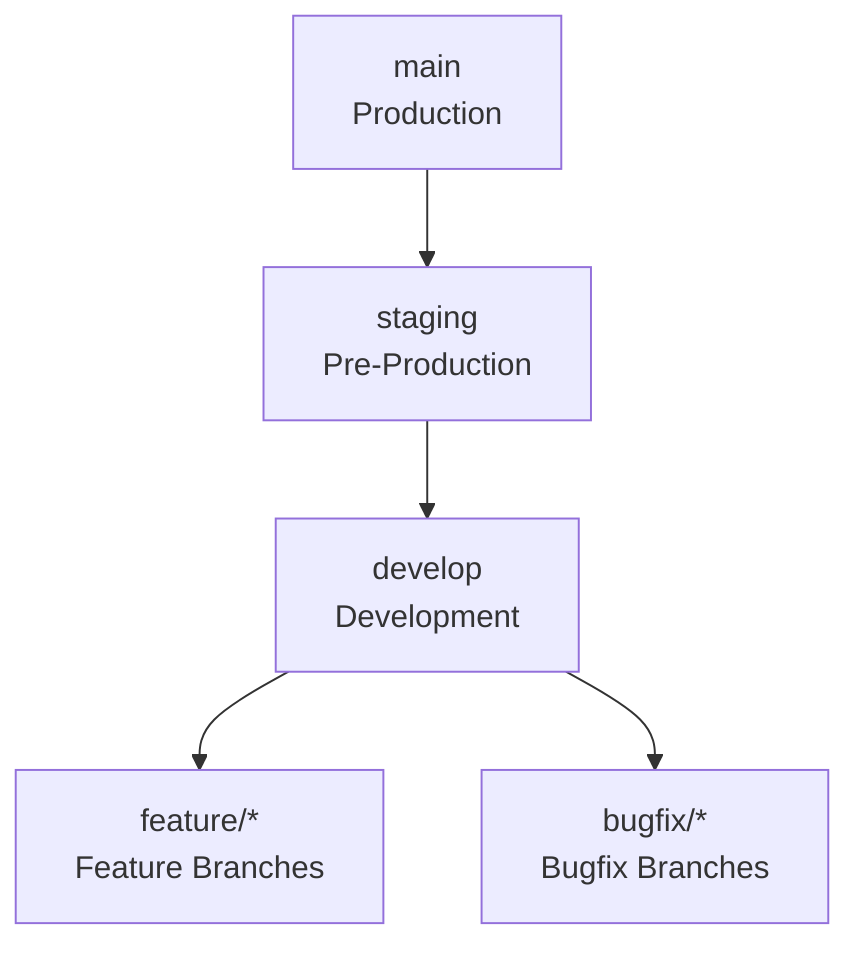
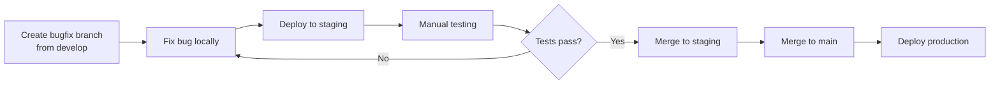

# Chore-Ganizer Branching Strategy

## Overview

This document outlines a Git branching strategy designed for a solo developer who wants to test features manually in a staging environment before deploying to production.

---

## Branch Structure



### Branch Types

| Branch | Purpose | Base | Merges To |
|--------|---------|------|-----------|
| `main` | Production-ready code | - | `staging` |
| `staging` | Pre-production testing | `main` | `main` |
| `develop` | Integration branch | `staging` | `staging` |
| `feature/*` | New features | `develop` | `develop` |
| `bugfix/*` | Bug fixes | `develop` | `develop` |

---

## Environment Strategy

### 1. Local Development (`localhost`)
- Run via `npm run dev` (backend + frontend)
- Uses SQLite dev database
- For rapid iteration and unit testing

### 2. Staging Environment (`staging.*` or separate port)
- Deploy `staging` branch
- Uses separate database instance
- Family members can test here
- **Manual testing happens here**

### 3. Production Environment (`main`)
- Deploy `main` branch
- Live data, live usage
- Only reached after staging passes

---

## Branch Naming Conventions

```
feature/<ticket-number>-<short-description>
bugfix/<ticket-number>-<short-description>
hotfix/<ticket-number>-<short-description>
release/<version>
```

**Examples:**
- `feature/42-add-recurring-chores`
- `bugfix/fix-login-timeout`
- `hotfix/security-patch-v2.1.8`
- `release/v2.2.0`

---

## Workflow: Feature Development

### Step 1: Start a Feature
```bash
# Update develop
git checkout develop
git pull origin develop

# Create feature branch
git checkout -b feature/42-add-notifications
```

### Step 2: Develop & Test Locally
- Write code
- Run unit tests: `npm run test`
- Run e2e tests: `npm run test:e2e`

### Step 3: Push & Deploy to Staging
```bash
# Commit changes
git add .
git commit -m "feat: add notification system"

# Push to remote
git push origin feature/42-add-notifications

# Deploy to staging (manual or CI)
# Merge into staging branch
git checkout staging
git merge feature/42-add-notifications
git push origin staging
```

### Step 4: Manual Testing in Staging
1. Access staging environment
2. Follow manual test cases from `docs/MANUAL-TESTING.md`
3. Test as Parent and as Child
4. Verify all new features work

### Step 5: Merge to Production
```bash
# If tests pass, merge to main
git checkout main
git merge staging
git push origin main
```

---

## Workflow: Bugfix



---

## Release Process

### Preparation
1. Update version in:
   - `package.json` (root)
   - `backend/package.json`
   - `frontend/package.json`
   - `CHANGELOG.md`

### Release Branch (Optional)
```bash
git checkout -b release/v2.2.0 develop
# Final testing, version bumps
git checkout main
git merge release/v2.2.0
git tag -a v2.2.0 -m "Release v2.2.0"
```

### Direct Merge (Simpler)
```bash
# Just merge staging to main
git checkout main
git merge staging
git tag -a v2.2.0 -m "Release v2.2.0"
git push origin main --tags
```

---

## CI/CD Integration

### Current: Runs on Every Push
- Unit tests
- Integration tests
- Build checks

### Recommended: Add Environment Gates

```yaml
# In .github/workflows/ci-cd.yml
on:
  push:
    branches:
      - main        # Deploy to production
      - staging     # Deploy to staging
      - develop    # Optional: deploy to dev
```

---

## Summary Table

| Action | Command |
|--------|---------|
| Start feature | `git checkout -b feature/42-desc develop` |
| Sync with upstream | `git pull origin develop` |
| Deploy to staging | `git checkout staging && git merge feature/42 && git push` |
| Deploy to prod | `git checkout main && git merge staging && git push` |
| Delete feature branch | `git branch -d feature/42 && git push origin --delete feature/42` |

---

## Quick Reference Card

```
┌─────────────────────────────────────────────────────────────┐
│                    BRANCHING QUICK REF                      │
├─────────────────────────────────────────────────────────────┤
│  main     ──► staging ──► develop ──► feature/bugfix      │
│   ↑            ↑             ↑              ↑               │
│ production  manual       integration    work here           │
│             testing                                          │
├─────────────────────────────────────────────────────────────┤
│ 1. create feature branch from develop                      │
│ 2. work & test locally                                      │
│ 3. merge to staging                                         │
│ 4. manual test in staging                                   │
│ 5. merge staging → main                                     │
│ 6. deploy main                                              │
└─────────────────────────────────────────────────────────────┘
```

---

## Next Steps

1. Create the initial branches:
   - `git checkout -b staging`
   - `git push origin staging`
   - `git checkout -b develop`
   - `git push origin develop`

2. Close the 6 open Dependabot PRs that are failing

3. Configure staging deployment (separate docker-compose or port)

4. Update CI/CD to deploy `staging` branch automatically
