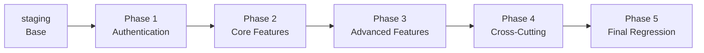

# Hybrid Manual Testing Strategy - Chore-Ganizer

## Overview

This document defines a hybrid branching/tagging strategy for managing 100+ manual tests across 5 phases. This approach combines **branches for test phases** with **tags for individual test completion**.

---

## Test Phase Organization

Based on `docs/MANUAL-TESTING.md`, tests are organized into **5 Phases**:



---

## Phase Structure

### Phase 1: Authentication (Foundation)
**Branch:** `test/phase1-auth`
**Purpose:** Core authentication tests needed before any other testing

| Category | Test IDs | Description |
|----------|----------|-------------|
| Parent Auth | P-001 to P-007 | Login, logout, session, protected routes |
| Child Auth | C-001 to C-007 | Same auth tests as child role |

**Estimated Tests:** ~14

---

### Phase 2: Core Features
**Branch:** `test/phase2-core`
**Purpose:** Core functionality that other features depend on

| Category | Test IDs | Description |
|----------|----------|-------------|
| User Management | P-101 to P-107 | Family members CRUD |
| Chore Templates | P-201 to P-2XX | Create, edit, delete templates |
| Chore Assignments | P-301 to P-3XX | Assign chores to users |
| Child Chore Viewing | C-101 to C-1XX | Children view assigned chores |

**Estimated Tests:** ~30

---

### Phase 3: Advanced Features
**Branch:** `test/phase3-advanced`
**Purpose:** Complex features built on core features

| Category | Test IDs | Description |
|----------|----------|-------------|
| Recurring Chores | P-401 to P-4XX | Schedule-based assignments |
| Pocket Money | P-501 to P-5XX | Points conversion, transactions |
| Statistics | P-601 to P-6XX | Analytics dashboard |
| Child Completion | C-201 to C-2XX | Children completing chores |

**Estimated Tests:** ~25

---

### Phase 4: Cross-Cutting Features
**Branch:** `test/phase4-crosscut`
**Purpose:** Features that affect multiple parts of the app

| Category | Test IDs | Description |
|----------|----------|-------------|
| Calendar | P-701 to P-7XX | Calendar view and interactions |
| Notifications | P-801, C-301 | ntfy, email alerts |
| Overdue Penalty | P-901 to P-9XX | Automatic penalty rules |

**Estimated Tests:** ~15

---

### Phase 5: Final Regression
**Branch:** `test/phase5-regression`
**Purpose:** End-to-end and platform-specific testing

| Category | Test IDs | Description |
|----------|----------|-------------|
| PWA | P-1001, C-401 | Progressive web app features |
| Responsive | P-1002 to P-100X | Mobile, tablet, desktop |
| Personal Dashboard | P-1101 to P-11XX | User-specific dashboards |
| Settings | P-1201 to P-12XX | App configuration |
| Smoke Test | All IDs | Quick sanity check |

**Estimated Tests:** ~16

---

## Branch Naming Convention

```
test/phase{1-5}-{name}
```

**Examples:**
- `test/phase1-auth`
- `test/phase2-core`
- `test/phase3-advanced`
- `test/phase4-crosscut`
- `test/phase5-regression`

---

## Tag Naming Convention

### Category Completion Tags
```
test/{phase}-cat-{category}-complete
test/{phase}-cat-{category}-fail
```

**Examples:**
```
test/phase1-auth-parent-complete     # Parent auth tests passed
test/phase1-auth-child-fail          # Child auth tests failed (P-102?)
test/phase2-core-user-mgmt-complete   # User management passed
```

### Individual Test Tags (Optional - for deep debugging)
```
test/P-102-fail                       # Specific test failed
test/P-102-pass                       # Specific test fixed and passed
```

---

## Workflow Rules

### Rule 1: Phase Order
> Tests MUST be executed in phase order (1 → 5)

```
Cannot start Phase 3 until Phase 1 & 2 are COMPLETE (green tags)
```

### Rule 2: Branch Creation
> Each phase branch starts from the PREVIOUS phase's COMPLETE tag

```bash
# Start Phase 2 from Phase 1's complete tag
git checkout -b test/phase2-core test/phase1-auth-parent-complete
```

### Rule 3: Tag Requirements
> Each category MUST be tagged, even if tests fail

```bash
# After completing Parent Auth in Phase 1
git tag -a test/phase1-auth-parent-complete -m "P-001 to P-007: 6 pass, 1 fail (P-006)"

# After completing Child Auth in Phase 1
git tag -a test/phase1-auth-child-complete -m "C-001 to C-007: All pass"
```

### Rule 4: Failure Handling
> When a test fails, create a fix branch and tag the failure point

```bash
# If P-102 fails in Phase 2:
git tag -a test/phase2-core-user-mgmt-fail -m "P-102 failed - password validation issue"
git checkout -b fix/p-102-password-validation

# Fix the issue, test locally
# Then continue testing from the fix branch
```

### Rule 5: Phase Completion
> A phase is complete when ALL categories have green (complete) tags

```bash
# Check Phase 1 status
git tag -l "test/phase1-*"

# Expected output:
# test/phase1-auth-parent-complete
# test/phase1-auth-child-complete
# → Phase 1 is GREEN - proceed to Phase 2
```

### Rule 6: Merge to Staging
> Only merge AFTER a phase is fully complete

```bash
# Phase 2 is complete
git checkout staging
git merge test/phase2-core
git tag -a test/phase2-merged -m "Phase 2 merged to staging"
git push origin staging --tags
```

---

## Quick Reference Commands

### Starting a New Phase
```bash
# From previous phase's complete tag
git checkout -b test/phase{N}-{name} test/phase{N-1}-{prev}-complete
```

### After Completing a Category
```bash
# Pass
git tag -a test/phase{N}-cat-{category}-complete -m "X/Y tests passed"

# Fail
git tag -a test/phase{N}-cat-{category}-fail -m "Z failed: [reason]"
```

### Checking Phase Status
```bash
git tag -l "test/phase{N}-*"
```

### Handling Failures
```bash
# Create fix branch from failure tag
git checkout -b fix/{issue-id} test/phase{N}-cat-{category}-fail

# After fix, continue testing
# Then tag as passed
git tag -a test/phase{N}-cat-{category}-complete -m "Fixed and re-tested"
```

### Merging Complete Phase
```bash
git checkout staging
git merge test/phase{N}-{name}
git push origin staging --tags
```

---

## Visual Progress Tracker

Create a simple markdown table to track progress:

```
## Phase Status

| Phase | Branch | Status | Notes |
|-------|--------|--------|-------|
| 1: Auth | test/phase1-auth | 🔴 In Progress | P-006 failing |
| 2: Core | test/phase2-core | ⏳ Not Started | - |
| 3: Advanced | test/phase3-advanced | ⏳ Not Started | - |
| 4: Cross-Cut | test/phase4-crosscut | ⏳ Not Started | - |
| 5: Regression | test/phase5-regression | ⏳ Not Started | - |

## Tag Status

| Phase | Category | Tag | Status |
|-------|----------|-----|--------|
| 1 | Parent Auth | test/phase1-auth-parent-complete | ✅ |
| 1 | Child Auth | test/phase1-auth-child-fail | ❌ |
```

---

## Summary

| Aspect | Rule |
|--------|------|
| **Branches** | 5 phase branches + fix branches |
| **Tags** | One per category (pass or fail) |
| **Order** | Phase 1 → 5 (sequential) |
| **Merge** | Only after phase complete |
| **Failure** | Tag + fix branch from failure point |

This hybrid approach gives you:
- ✅ Isolation between test phases
- ✅ Checkpoints within phases (tags)
- ✅ Clear progression path
- ✅ Easy recovery from failures
