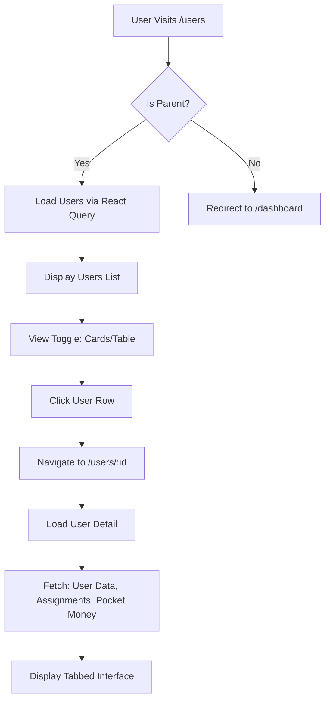

# User Management Frontend Implementation Plan

**Chore-Ganizer v2.1.7**  
**Created:** 2026-03-09  
**Mode:** Architect

---

## 1. Executive Summary

This document outlines a comprehensive implementation plan for enhancing the User Management frontend in the Chore-Ganizer project. The current implementation provides basic CRUD functionality through a card-based layout, but lacks several features needed for comprehensive family member management.

### Current State
- Basic user list displayed as cards
- Edit modal for updating user details
- Delete functionality with confirmation
- Parent-only access to the page

### Target State
- Table view alongside card view for better data management
- Dedicated user detail page with tabbed interface
- Create new user functionality
- User account management (lock/unlock)
- Integration with related data (assignments, pocket money, statistics)

---

## 2. Backend API Analysis

### Existing Endpoints

| Method | Endpoint | Access | Description |
|--------|----------|--------|-------------|
| GET | `/api/users` | All authenticated | List all users |
| GET | `/api/users/:id` | Parents only | Get single user |
| GET | `/api/users/:id/assignments` | User/Parent | Get user's chore assignments |
| PUT | `/api/users/:id` | Parents only | Update user |
| POST | `/api/auth/register` | Public | Register new user |

### Related User Endpoints (Other Services)

| Method | Endpoint | Access | Description |
|--------|----------|--------|-------------|
| GET | `/api/pocket-money/balance/:userId` | User/Parent | Get point balance |
| GET | `/api/pocket-money/transactions/:userId` | User/Parent | Get transaction history |
| POST | `/api/pocket-money/bonus` | Parents only | Add bonus points |
| POST | `/api/pocket-money/deduction` | Parents only | Deduct points |
| GET | `/api/auth/lockout-status/:userId` | Parents only | Get account lockout status |
| POST | `/api/auth/unlock/:userId` | Parents only | Unlock user account |

### Gap Analysis

1. **Missing POST /api/users** - No dedicated user creation endpoint; relies on public `/api/auth/register`
2. **Missing DELETE /api/users/:id** - Delete functionality not exposed in routes
3. **No user statistics endpoint** - Would need to aggregate data from assignments
4. **No role change validation** - Cannot downgrade a parent to child via API

---

## 3. Frontend Architecture

### Current Structure

```
frontend/src/
├── api/
│   └── # Existing API client users.api.ts         
├── hooks/
│   └── useUsers.ts           # Existing useState-based hook
├── pages/
│   └── Users.tsx             # Existing page (card-based)
└── types/
    └── index.ts              # User type definitions
```

### Proposed Structure

```
frontend/src/
├── api/
│   └── users.api.ts          # Enhanced with new endpoints
├── components/
│   └── users/                # NEW: User-specific components
│       ├── UserCard.tsx      # User display card
│       ├── UserTable.tsx     # User data table
│       ├── UserForm.tsx      # Create/Edit form
│       ├── UserDetail.tsx    # Detail page container
│       ├── UserStats.tsx     # Statistics tab
│       ├── UserAssignments.tsx # Assignments tab
│       ├── UserPocketMoney.tsx # Pocket money tab
│       ├── ColorPicker.tsx   # User color selection
│       ├── ConfirmDialog.tsx # Delete confirmation
│       └── LockoutBadge.tsx  # Account status indicator
├── hooks/
│   └── useUsers.ts           # Enhanced with React Query
├── pages/
│   └── Users.tsx             # Enhanced page
└── types/
    └── index.ts              # Enhanced types
```

---

## 4. UI/UX Design Specifications

### 4.1 Users List Page (Enhanced)

**Route:** `/users`

**Layout Options:**
- Toggle between Card View and Table View
- Search/filter functionality
- Sort by name, role, points

**Card View (Current):**
- Grid layout (1-3 columns responsive)
- User avatar with color
- Name, email, role badge
- Points balance
- Quick action buttons

**Table View (New):**
- Columns: Avatar, Name, Email, Role, Points, Base Pocket Money, Color, Created, Actions
- Sortable columns
- Pagination (20 items per page)
- Row click to view details
- Bulk actions (future enhancement)
- **Visibility: Desktop (≥1024px) and Tablet (≥768px) only**

### 4.2 User Detail Page (New)

**Route:** `/users/:id`

**Layout:**
- Header with user info and avatar
- Tabbed interface for related data
- Sidebar with quick stats

**Tabs:**
1. **Overview** - Basic info, role, color, statistics summary
2. **Assignments** - Chore assignments (pending, completed, overdue)
3. **Pocket Money** - Balance, transactions, payouts
4. **Settings** - Notification settings (read-only view)

### 4.3 User Create/Edit Form

**Fields:**
| Field | Type | Required | Validation |
|-------|------|----------|------------|
| Name | Text | Yes | 1-100 chars |
| Email | Email | Yes | Valid email, unique |
| Password | Password | Yes (create) | 8+ chars, complexity requirements |
| Role | Select | Yes | PARENT or CHILD |
| Color | Color Picker | No | Hex color |
| Base Pocket Money | Number | No (children only) | 0+, 2 decimal places |

### 4.4 Delete Confirmation Dialog

- Modal with warning icon
- User name and avatar
- **Validation: Check for active assignments before showing delete option**
- Warning about cascading effects (transactions can remain)
- Confirm/Cancel buttons
- Loading state during deletion

---

## 5. Component Specifications

### 5.1 UserCard Component

**Props:**
```typescript
interface UserCardProps {
  user: User;
  onEdit?: (user: User) => void;
  onDelete?: (userId: number) => void;
  onClick?: (user: User) => void;
}
```

**Features:**
- Displays user avatar with color
- Shows name, email, role badge
- Points display
- Base pocket money (for children)
- Edit button (parents only)
- Delete button (parents only, non-parent users)

### 5.2 UserTable Component

**Props:**
```typescript
interface UserTableProps {
  users: User[];
  onSort?: (field: string, direction: 'asc' | 'desc') => void;
  onPageChange?: (page: number) => void;
  onEdit?: (user: User) => void;
  onDelete?: (userId: number) => void;
  onRowClick?: (user: User) => void;
}
```

**Features:**
- Sortable columns
- Pagination controls
- Row selection (future)
- Responsive: collapses to card view on mobile

### 5.3 UserForm Component

**Props:**
```typescript
interface UserFormProps {
  user?: User; // undefined for create mode
  onSubmit: (data: CreateUserData | UpdateUserData) => Promise<void>;
  onCancel: () => void;
  loading?: boolean;
}
```

**Features:**
- Form validation with error messages
- Password strength indicator (create mode)
- Color picker with preview
- Conditional fields based on role

### 5.4 ColorPicker Component

**Features:**
- Predefined color palette (12 colors)
- Custom color input (hex)
- Live preview
- Color preview in user avatar

**Predefined Colors:**
```
#3B82F6 (Blue)   #10B981 (Green)  #F59E0B (Amber)
#EF4444 (Red)    #8B5CF6 (Purple) #EC4899 (Pink)
#06B6D4 (Cyan)   #F97316 (Orange) #6366F1 (Indigo)
#14B8A6 (Teal)   #84CC16 (Lime)   #6B7280 (Gray)
```

---

## 6. State Management

### Current Approach
- Local useState in hooks
- Manual fetch/refetch on mutations

### Recommended Approach: React Query (Global Adoption)

**Benefits:**
- Automatic background refetching
- Caching and deduplication
- Optimistic updates
- Loading/error states built-in

**Scope:** Implement React Query globally for ALL data fetching:
- Users
- Chore Assignments
- Chore Templates
- Categories
- Pocket Money
- Notifications
- Statistics
- Recurring Chores

**Implementation Pattern:**

```typescript
// hooks/useUsers.ts - React Query version
import { useQuery, useMutation, useQueryClient } from '@tanstack/react-query'
import { usersApi } from '../api'

export function useUsers() {
  const queryClient = useQueryClient()
  
  // Query for all users
  const usersQuery = useQuery({
    queryKey: ['users'],
    queryFn: usersApi.getAll,
  })
  
  // Mutation for creating user
  const createMutation = useMutation({
    mutationFn: usersApi.create,
    onSuccess: () => {
      queryClient.invalidateQueries({ queryKey: ['users'] })
    },
  })
  
  // ... other mutations
}
```

---

## 7. Routing Structure

### Current Routes
```
/users           - Users list (parents only)
```

### Proposed Routes
```
/users                       - Users list (parents only)
/users/new                   - Create user form (parents only)
/users/:id                   - User detail view (parents only)
/users/:id/edit              - Edit user form (parents only)
```

### Route Protection
- All `/users/*` routes require `isParent === true`
- Redirect children to `/dashboard` if attempting to access

---

## 8. Role-Based Access Control

### Parent Capabilities
- View all users
- Create new users
- Edit any user
- Delete non-parent users
- Lock/unlock accounts
- View all user data (assignments, pocket money)

### Child Capabilities
- View own profile only
- Cannot access `/users` page
- Can view own data in Profile page

### UI Differentiation
- Sidebar: "Family Members" link only visible to parents
- Users page: Full access for parents, redirect for children

---

## 9. Integration Points

### 9.1 Chore Assignments
- Fetch assignments when viewing user detail
- Show pending/completed/overdue counts
- Link to filtered assignment views

### 9.2 Pocket Money
- Fetch balance and transactions
- Show earnings history
- Quick bonus/deduction actions

### 9.3 Calendar
- User color used for assignment visualization
- Filter calendar by user

### 9.4 Statistics
- Aggregate user statistics for dashboard
- Per-user completion rates

---

## 10. Dependencies

### Required Packages
| Package | Version | Purpose |
|---------|---------|---------|
| @tanstack/react-query | ^5.x | Data fetching & caching |
| @tanstack/react-query-devtools | ^5.x | DevTools for debugging |
| date-fns | ^3.x | Date formatting |
| react-router-dom | ^6.x | Already installed |

### No New Dependencies Needed
- handling: Use native Form React state (current approach works well)
- Table: Build custom or use existing patterns
- Color picker: Build custom component

---

## 11. Phased Implementation

### Phase 1: Foundation (High Priority)
1. Add React Query to frontend dependencies
2. Create `useUsers` hook with React Query
3. Update API client with new endpoints
4. Add user types for new data structures

### Phase 2: UI Components (High Priority)
1. Create `UserTable` component
2. Create `UserForm` component
3. Create `ColorPicker` component
4. Enhance `Users` page with view toggle

### Phase 3: Detail View (Medium Priority)
1. Create user detail page
2. Add tabbed interface
3. Integrate assignments tab
4. Integrate pocket money tab

### Phase 4: Account Management (Medium Priority)
1. Add lock/unlock functionality
2. Create confirmation dialog
3. Add account status badges

### Phase 5: Polish (Lower Priority)
1. Add animations and transitions
2. Improve mobile responsiveness
3. Add keyboard shortcuts
4. Accessibility improvements

---

## 12. Data Flow



---

## 13. Error Handling

### API Errors
- Display user-friendly error messages
- Retry failed requests automatically (React Query)
- Show inline validation errors on forms

### Edge Cases
- Empty user list: Show "No family members" message with create prompt
- Network offline: Show offline indicator, disable mutations
- Concurrent edits: Last-write-wins with notification

---

## 14. Testing Strategy

### Unit Tests
- Component rendering
- Form validation
- Utility functions

### Integration Tests
- Full user CRUD flow
- View transitions
- Role-based access

### E2E Tests
- Create user flow
- Edit user flow
- Delete user flow
- View user details

---

## 15. Implementation Checklist

### Backend Additions (If Needed)
- [ ] Add DELETE /api/users/:id endpoint (currently missing)
- [ ] Add POST /api/users endpoint (parent-authorized creation)
- [ ] Add GET /api/users/:id/statistics endpoint
- [ ] Add role change validation (prevent last parent downgrade)
- [ ] Add assignment check before delete (prevent if active assignments)
- [ ] Update validation schemas if needed

### Frontend Implementation
- [ ] Install React Query packages
- [ ] Set up React Query provider in App.tsx
- [ ] Update types/index.ts
- [ ] Create UserTable component
- [ ] Create UserForm component
- [ ] Create ColorPicker component
- [ ] Create ConfirmDialog component
- [ ] Create UserDetail page
- [ ] Enhance Users page with view toggle
- [ ] Add routes for /users/:id and /users/new
- [ ] Add lock/unlock UI
- [ ] Update Sidebar with new routes
- [ ] Add tests

---

## 16. Questions for Clarification

The following questions have been answered by the stakeholder:

### Q1: User Creation Flow
**Answer:** Repurpose the public registration flow with parent authorization

- Create a parent-controlled user creation flow
- Parent fills in user details and sets initial password
- Account is created directly (not via public registration)

### Q2: Delete Behavior
**Answer:** Prevent deletion if user has active assignments

- Check for pending assignments before deletion
- Show error message if user has active assignments
- Allow deletion only for users with no pending assignments

### Q3: Role Changes
**Answer:** Allow role changes, but prevent the last parent from being downgraded

- Parents can change any user's role
- System prevents downgrading the last remaining parent to child
- Show error: "Cannot remove the last parent account"

### Q4: React Query Adoption
**Answer:** Adopt React Query for all data fetching

- Implement React Query globally
- Replace useState/useEffect patterns with useQuery/useMutation
- Use for users, chores, assignments, pocket money, etc.

### Q5: Mobile Table View
**Answer:** Hide the table view entirely on mobile

- Table view only available on tablet (≥768px) and desktop
- Mobile devices always show card view
- Use CSS media queries for responsive behavior

---

## 17. Summary

This implementation plan provides a comprehensive roadmap for enhancing the User Management frontend in Chore-Ganizer. The current card-based implementation serves as a solid foundation, and the proposed enhancements will add:

- Flexible viewing options (cards/table)
- Comprehensive user detail views
- Full CRUD operations
- Better integration with related features
- Improved user experience with React Query

The plan is structured in phases to allow incremental delivery and testing. Each phase builds upon the previous one, reducing risk and allowing for feedback incorporation.
